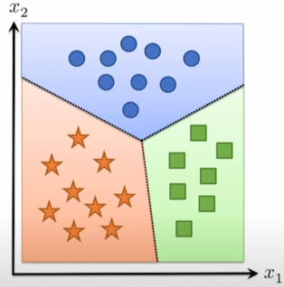
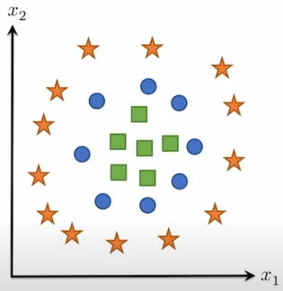
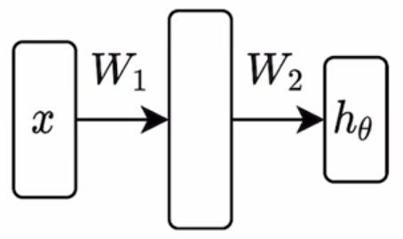

# Backpropagation

这是[Lecture 3 (Part I) - "Manual" Neural Networks](https://www.youtube.com/watch?v=OyrqSYJs7NQ&t=1468s)和[Lecture 3 (Part II) - "Manual" Neural Networks](https://www.youtube.com/watch?v=JLg1HkzDsKI)的笔记。

## The gradients of a two-layer network

### two-layer network

在实际场景下，linear hypothesis class无法分类所有情况

因此往往采用MLP，也就是线性网络+非线性网络嵌套。一个最简单的例子就是two-layer network，
$$
\sigma(XW_1)W_2
$$

这里 $\sigma$ 表示一个对逐个元素的非线性变换，比如常见的ReLU、tanh等。

$X\in\mathbb R^{m\times n},W_1\in\mathbb R^{n\times d}, W_2\in\mathbb R^{d\times k}$

### gradients

令 $X$ 表示输入是batch matrix form。

> 目标：计算 $\nabla_{\{W_1,W_2\}}\ell_{ce}(\sigma(XW_1)W_2,y)$。

#### $W_2$

然后我们还是“将一切视作标量”，直接链式求导，
$$
\begin{aligned}
\frac{\partial \ell_{ce}(\sigma(XW_1)W_2,y)}{\partial W_2} &= \frac{\partial \ell_{ce}(\sigma(XW_1)W_2,y)}{\partial \sigma(XW_1)W_2}\cdot \frac{\partial \sigma(XW_1)W_2}{\partial W_2}\\
&= (S - I_y)\cdot \sigma(XW_1)\quad(S=\text{normalize}(\exp(\sigma(XW_1)W_2)))
\end{aligned}
$$
然后调整维度，$(S-I_y)\in\mathbb R^{m\times k},\sigma(XW_1)\in R^{m\times d}$，而我们是对 $W_2\in\mathbb R^{d\times k}$ 求偏导，因此
$$
\nabla_{W_2}\ell_{ce}(\sigma(XW_1)W_2,y) = (\sigma(XW_1))^T\cdot (S-I_y)
$$

#### $W_1$

再对 $W_1$ 求偏导，
$$
\begin{aligned}
\frac{\partial \ell_{ce}(\sigma(XW_1)W_2,y)}{\partial W_1} &= \frac{\partial \ell_{ce}(\sigma(XW_1)W_2,y)}{\partial \sigma(XW_1)W_2}\cdot \frac{\partial \sigma(XW_1)W_2}{\partial \sigma(XW_1)}\cdot \frac{\partial \sigma(XW_1)}{\partial XW_1}\cdot \frac{\partial XW_1}{\partial W_1}\\
&= (S-I_y)\cdot W_2\cdot \sigma^\prime(XW_1)\cdot X
\end{aligned}
$$
这里 $\sigma$ 是一个标量函数，所以 $\sigma^\prime$ 就是这个标量函数的导数，比如ReLU的导数就是一个分段函数 $\sigma'(x)=0,x\le 0;1,x\gt 0$。

对于上面这一串连乘，我们列出维度：$(S-I_y)\in\mathbb R^{m\times k}, W_2\in\mathbb R^{d\times k}, \sigma^\prime(XW_1)\in\mathbb R^{m\times d}, X\in\mathbb R^{m\times n}$，而 $W_1\in\mathbb R^{n\times d}$，因此
$$
\nabla_{W_1}\ell_{ce}(\sigma(XW_1)W_2,y) = X^T(\sigma^\prime(XW_1) \circ ((S-I_y)W_2^T))
$$
这里 $\circ$ 表示标量积，即逐元素相乘。

> 这里的启发就是~~不要手算了~~。

## Backpropagation "in general"

假设我们有一个全连接网络 $Z_{i+1} = \sigma_i(Z_iW_i);i=1,\ldots,L$，如果要求最后一层的偏导，那么就有
$$
\frac{\partial \ell(Z_{L+1},y)}{\partial W_i} = \frac{\partial \ell}{\partial  Z_{L+1}}\cdot \frac{\partial Z_{L+1}}{\partial Z_L}\cdots \frac{\partial Z_{i+2}}{\partial Z_{i+1}}\cdot \frac{\partial Z_{i+1}}{\partial W_i}
$$
注意到这里的链式求导很多都是重复的操作，设
$$
G_{i+1} = \frac{\partial \ell}{\partial  Z_{L+1}}\cdot \frac{\partial Z_{L+1}}{\partial Z_L}\cdots \frac{\partial Z_{i+2}}{\partial Z_{i+1}}
$$
则有一个简单的递推关系
$$
G_i = G_{i+1}\cdot \frac{\partial Z_{i+1}}{\partial Z_i} = G_{i+1}\cdot \frac{\partial \sigma(Z_iW_i)}{\partial Z_iW_i}\cdot\frac{\partial Z_iW_i}{\partial Z_i} = G_{i+1}\cdot \sigma^\prime(Z_iW_i)\cdot W_i
$$
这里 $G_i = \nabla_{Z_i}\ell(Z_{L+1},y)\in\mathbb R^{m\times n_i},Z_i\in\mathbb R^{m\times n_i},W_i\in\mathbb R^{n_i\times n_{i+1}}$。

因此我们调整 $G_{i+1}\cdot \sigma^\prime(Z_iW_i)\cdot W_i$ 的维度为
$$
G_i = \nabla_{Z_i}\ell(Z_{L+1},y) = (G_{i+1}\circ \sigma^\prime(Z_iW_i)) \cdot W_i^T
$$
最后就可以求出我们实际上需要的梯度 $\nabla_{W_i}\ell(Z_{L+1},y)$，
$$
\begin{aligned}
\frac{\partial \ell(Z_{L+1},y)}{\partial W_i} &= \nabla_{W_i}\ell(Z_{L+1},y)\\
&= G_{i+1}\cdot \frac{\partial Z_{i+1}}{\partial W_i}\\
&= G_{i+1}\cdot \frac{\partial \sigma_i(Z_iW_i)}{\partial W_i}\\
&= G_{i+1}\cdot \frac{\partial \sigma_i(Z_iW_i)}{\partial Z_iW_i}\cdot \frac{\partial Z_iW_i}{\partial W_i}\\
&= G_{i+1}\cdot \sigma^\prime(Z_iW_i) \cdot Z_i
\end{aligned}
$$
最后再调整维度为
$$
\frac{\partial \ell(Z_{L+1},y)}{\partial W_i} = \nabla_{W_i}\ell(Z_{L+1},y) = Z_i^T \cdot (G_{i+1}\circ \sigma^\prime(Z_iW_i))
$$

## Backpropagation: Forward and backward passes

1. Forward pass
   - Initialize: $Z_1=X$，
   - Iterate: $Z_{i+1} = \sigma_i(Z_iW_i); i=1,\ldots,L$。
2. Backward pass
   - Initialize: $G_{L+1} = \nabla_{Z_{L+1}}\ell(Z_{L+1},y) = S-I_y$，
   - Iterate: $G_i = (G_{i+1}\circ \sigma^\prime(Z_iW_i)) \cdot W_i^T; i=L,\ldots,1$，
   - Compute gradients: $\nabla_{W_i}\ell(Z_{L+1},y) = Z_i^T \cdot (G_{i+1}\circ \sigma^\prime(Z_iW_i))$。

