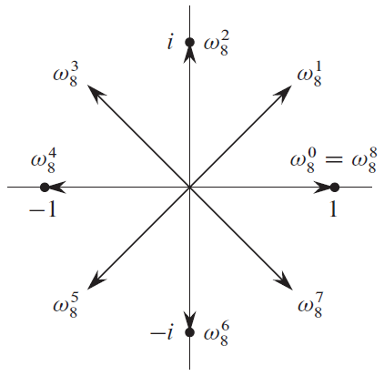
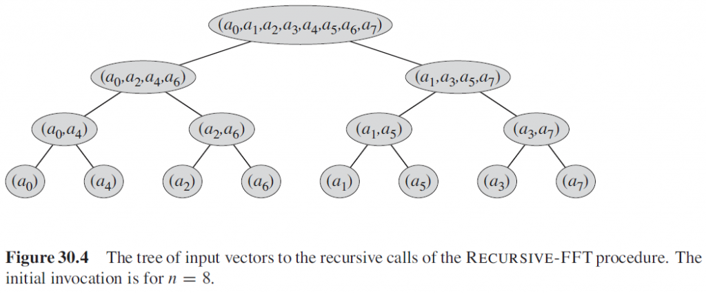

# 快速傅里叶变换

## 点值表示法

对于一个 $n-1$ 阶多项式 $P(x)=a_0+a_1x+a_2x^2+\cdots+a_{n-1}x^{n-1}$，如果我们已知一个点集 $S:\{(x_0,y_0),(x_1,y_1),\cdots,(x_{n-1},y_{n-1})\}$，点集 $S$ 中的所有点都满足 $y_i=P(x_i)$，且 $x_i(i=0,1,\cdots,n-1)$ 各不相同。那么这个点集 $S$ 就是多项式 $P(x)$ 的一个点值表示。

### 插值多项式

通过点值表达式还原多项式的操作就是插值，这等价于求解一个线性方程组：
$$
\begin{cases} a_0+a_1x_{0}+a_2x_{0}^2+\cdots+a_{n-1}x_{0}^{n-1}=y_0\\ a_0+a_1x_{1}+a_2x_{1}^2+\cdots+a_{n-1}x_{1}^{n-1}=y_1\\ \cdots\\ a_0+a_1x_{n-1}+a_2x_{n-1}^2+\cdots+a_{n-1}x_{n-1}^{n-1}=y_{n-1}\\ \end{cases}
$$
表示成矩阵形式就是
$$
\begin{bmatrix} 1 & x_0 & x_0^2 & \cdots & x_0^{n-1}\\ 1 & x_1 & x_1^2 & \cdots & x_1^{n-1}\\ \vdots & \vdots & \vdots & \ddots & \vdots\\ 1 & x_{n-1} & x_{n-1}^2 & \cdots & x_{n-1}^{n-1}\\ \end{bmatrix} \begin{bmatrix} a_0\\ a_1\\ \vdots\\ a_{n-1} \end{bmatrix}= \begin{bmatrix} y_0\\ y_1\\ \vdots\\ y_{n-1} \end{bmatrix}
$$
这里系数矩阵 $\begin{bmatrix} 1 & x_0 & x_0^2 & \cdots & x_0^{n-1}\\ 1 & x_1 & x_1^2 & \cdots & x_1^{n-1}\\ \vdots & \vdots & \vdots & \ddots & \vdots\\ 1 & x_{n-1} & x_{n-1}^2 & \cdots & x_{n-1}^{n-1}\\ \end{bmatrix}$ 是[范德蒙德矩阵](https://en.wikipedia.org/wiki/Vandermonde_matrix)，该矩阵的行列式值是 $\prod_{0\le i\lt j\lt n}(x_j-x_i)$，因为 $x_i(i=0,1,\cdots,n-1)$ 各不相同，所以该矩阵的行列式值 $\neq0$，即系数矩阵满秩，该线性方程组只能有唯一解。并且可以计算出多项式系数向量：
$$
\begin{bmatrix} a_0\\ a_1\\ \vdots\\ a_{n-1} \end{bmatrix}= \begin{bmatrix} 1 & x_0 & x_0^2 & \cdots & x_0^{n-1}\\ 1 & x_1 & x_1^2 & \cdots & x_1^{n-1}\\ \vdots & \vdots & \vdots & \ddots & \vdots\\ 1 & x_{n-1} & x_{n-1}^2 & \cdots & x_{n-1}^{n-1}\\ \end{bmatrix}^{-1} \begin{bmatrix} y_0\\ y_1\\ \vdots\\ y_{n-1} \end{bmatrix}
$$

### 点值表示法下的多项式乘法

假设多项式 $C(x)=A(x)B(x)$，其中 $A(x)$ 的度数（最高次幂）为 $n$，$B(x)$ 的度数为 $m$，此时 $C(x)$ 的度数 $\deg C = \deg A + \deg B = n+m$。如果要通过点值表示法插值出原多项式 $C(x)$，显然至少需要 $n+m+2$ 个点。因此，多项式 $A(x),B(x)$ 的点值表示都需要 $n+m+2$ 个点，设点集分别为 $S_A,S_B$：

$$
\begin{cases}
S_A:\{(x_0,y_0),(x_1,y_1),\cdots,(x_{n+m+1},y_{n+m+1})\}\\
S_B:\{(x_0,y^\prime_0),(x_1,y^\prime_1),\cdots,(x_{n+m+1},y^\prime_{n+m+1})\}
\end{cases}
$$

对于任意点 $x_k$，$C(x_k)=A(x_k)B(x_k)$。因此，多项式 $C(x)$ 的点值表示为

$$
\{(x_0,y_0y^\prime_0),(x_1,y_1y^\prime_1),\cdots,(x_{n+m+1},y_{n+m+1}y^\prime_{n+m+1})\}
$$

利用点值表示法求多项式乘法的流程实际上就是：

1. 将给定的多项式 $A(x),B(x)$（设度数都是 $O(N)$ 量级）分别转变为点值表示
2. 通过 $A(x),B(x)$ 的点值表示计算出 $C(x)$ 的点值表示
3. 通过 $C(x)$ 的点值表示插值还原出系数多项式

其中第2步的时间复杂度显然为 $O(N)$，如果我们可以通过合理的点集选取，使得第一步和第三步都能够在 $O(N\log N)$ 的复杂度下实现，那么我们就得到了一个总复杂度为 $O(N\log N)$ 的多项式乘法算法。

## 快速傅里叶变换

### 单位复根

$n$ **次单位复根** 是满足 $\omega^n=1$ 的复数 $\omega$，这样的复根恰好有 $n$ 个：$\omega = e^{\frac{2\pi k i}{n}}(k=0,1,\cdots,n-1)$。根据欧拉公式可知，这些复根均匀地分布在复平面的单位圆上。

<figure>



<figcaption>8次单位复根的示例</figcaption>
</figure>  

### 一些引理

#### 消去引理

> 对任意整数 $n\ge 0,k\ge 0$ 以及 $d\gt 0$，
> $$
> \omega_{dn}^{dk} = \omega_n^k
> $$

从几何意义考虑，这个引理是显然的，并且由此可以得出一个推论：$\omega_{2n}^n = -1$。

#### 折半引理

> 如果 $n\gt 0$ 是偶数，那么 $n$ 个 $n$ 次单位复根的平方的集合就是 $\frac n 2$ 个 $\frac n 2$ 次单位复根的集合。

证明：根据消去引理有 $(\omega_n^k)^2 = \omega_{n/2}^k$。并且注意到，如果对所有 $n$ 次单位复根进行平方，那么获得每个 $\frac n 2$ 次单位根正好 $2$ 次，因为

$$
(\omega_{n}^{k+n/2})^2 = \omega_n^{2k+n} = \omega_n^{2k}\omega_n^n = (\omega_n^k)^2
$$

即 $\omega_n^k$ 和 $\omega_{n}^{k+n/2}$ 的平方相同。

#### 求和引理

> 对任意整数 $n\ge 1$ 和不能被 $n$ 整除的非负整数 $k$，有
> $$
> \sum_{j=0}^{n-1} (\omega_n^k)^j = 0
> $$

$$
\sum_{j=0}^{n-1} (\omega_n^k)^j = \frac{(\omega_n^k)^n-1}{\omega_n^k-1} = \frac{(\omega_n^n)^k-1}{\omega_n^k-1} = 0
$$

### 离散傅里叶变换(DFT)

回想一下我们的问题：计算多项式乘法 $C(x)=A(x)B(x)$。为了 $O(N\log N)$ 解决这个问题，我们需要将系数表示转换为点值表示，这里我们对于点值表示法的选取就是 $n$ 次单位复根，即我们希望计算多项式

$$
A(x) = \sum_{j=0}^{n-1} a_jx^j
$$

在 $\omega_n^0,\omega_n^1,\cdots,\omega_n^{n-1}$ 处的值（即 $n$ 个 $n$ 次单位复根处）。假设 $A(x)$ 的系数表示用向量 $\vec a = (a_0,a_1,\cdots,a_{n-1})$ 表示，定义：

$$
y_k = A(\omega_n^k) = \sum_{j=0}^{n-1}a_j\omega_n^{kj}
$$

则向量 $\vec y = (y_0,y_1,\cdots,y_{n-1})$ 就是系数向量 $\vec a = (a_0,a_1,\cdots,a_{n-1})$ 的**离散傅里叶变换（DFT）**，记作 $y=\text{DFT}_n(a)$。

这里的公式可以与[傅里叶变换文中的离散傅里叶变换公式](https://st1vdy.xyz/index.php/2024/03/23/fourier_transform/)作比较，不难发现本质上是相同的。

### **快速傅里叶变换**(FFT)

本章节中，假设 $n$ 是 $2$ 的整数次幂。

**快速傅里叶变换（FFT）**实际上就是利用 $n$ 次单位复根的性质，在 $O(n\log n)$ 的时间复杂度下计算出 $n-1$ 阶多项式 $A(x) = \sum_{j=0}^{n-1} a_jx^j$ 的点值表示。按照下标的奇偶性，分别定义两个多项式 $A^{[0]}(x),A^{[1]}(x)$：
$$
\begin{aligned} A^{[0]}(x) &= a_0 + a_2 x + a_4 x^2 + \cdots + a_{n-2}x^{n/2-1}\\ A^{[1]}(x) &= a_1 + a_3 x + a_5 x^2 + \cdots + a_{n-1}x^{n/2-1}\\ \end{aligned}
$$
原多项式 $A(x) = A^{[0]}(x^2) + xA^{[1]}(x^2)$。

> 比如 $7$ 阶多项式 $f(x) = a_0+a_1x+a_2x^2+a_3x^3+a_4x^4+a_5x^5+a_6x^6+a_7x^7$ 就处理为：
> $$
> f(x) = (a_0+a_2x^2+a_4x^4+a_6x^6)+(a_1x+a_3x^3+a_5x^5+a_7x^7)
> $$
> 其中 $f^{[0]}(x) = a_0 + a_2x+a_4x^2+a_6x^3,f^{[1]}(x) = a_1+a_3x+a_5x^2+a_7x^3$。于是 $f(x) = f^{[0]}(x^2)+xf^{[1]}(x^2)$。

于是，求 $A(x)$ 在 $\omega_n^0,\omega_n^1,\cdots,\omega_n^{n-1}$ 处的值就转化为：求两个新的多项式 $A^{[0]}(x),A^{[1]}(x)$ 在 $(\omega_n^0)^2,(\omega_n^1)^2,\cdots,(\omega_n^{n-1})^2$ 处的值，根据折半引理可知这 $n$ 个点的点值实际上只有 $\frac n 2$ 个不同的取值（因为 $(\omega_{n}^{k+n/2})^2 = (\omega_n^k)^2$），这就使得子问题的量级减半了，即求 $\text{DFT}_n$ 转化为了两个 $\text{DFT}{\frac n 2}$ 的子问题，时间复杂度如下：
$$
T(n) = 2T(\frac n 2) + \Theta(n) = \Theta(n\log n)
$$

### 快速傅里叶逆变换(Inverse FFT)

求出多项式的点值表示后，我们还需要将点值表示逆运算为常见的系数表示，这一步就是**离散傅里叶逆变换(IDFT)**。前文中，我们已经提到了IDFT就是插值，即解方程
$$
\begin{bmatrix} 1 & x_0 & x_0^2 & \cdots & x_0^{n-1}\\ 1 & x_1 & x_1^2 & \cdots & x_1^{n-1}\\ \vdots & \vdots & \vdots & \ddots & \vdots\\ 1 & x_{n-1} & x_{n-1}^2 & \cdots & x_{n-1}^{n-1}\\ \end{bmatrix} \begin{bmatrix} a_0\\ a_1\\ \vdots\\ a_{n-1} \end{bmatrix}= \begin{bmatrix} y_0\\ y_1\\ \vdots\\ y_{n-1} \end{bmatrix}
$$
在FFT中，点值表示选用了 $n$ 次单位复根，上方的方程可以进一步写成
$$
\begin{bmatrix} a_0\\ a_1\\ \vdots\\ a_{n-1} \end{bmatrix}= \begin{bmatrix} \omega_n^0 & \omega_n^0 & \omega_n^0 & \cdots & \omega_n^0\\ \omega_n^0 & \omega_n^1 & \omega_n^2 & \cdots & \omega_n^{n-1}\\ \vdots & \vdots & \vdots & \ddots & \vdots\\ \omega_n^0 & \omega_n^{n-1} & \omega_n^{2(n-1)} & \cdots & \omega_n^{(n-1)(n-1)}\\ \end{bmatrix}^{-1} \begin{bmatrix} y_0\\ y_1\\ \vdots\\ y_{n-1} \end{bmatrix}
$$
这个单位复根构成的逆矩阵可以表示为以下形式：
$$
\begin{bmatrix} \omega_n^0 & \omega_n^0 & \omega_n^0 & \cdots & \omega_n^0\\ \omega_n^0 & \omega_n^1 & \omega_n^2 & \cdots & \omega_n^{n-1}\\ \vdots & \vdots & \vdots & \ddots & \vdots\\ \omega_n^0 & \omega_n^{n-1} & \omega_n^{2(n-1)} & \cdots & \omega_n^{(n-1)(n-1)}\\ \end{bmatrix}^{-1}= \frac 1 n\begin{bmatrix} \omega_n^0 & \omega_n^0 & \omega_n^0 & \cdots & \omega_n^0\\ \omega_n^0 & \omega_n^{-1} & \omega_n^{-2} & \cdots & \omega_n^{-(n-1)}\\ \vdots & \vdots & \vdots & \ddots & \vdots\\ \omega_n^0 & \omega_n^{-(n-1)} & \omega_n^{-2(n-1)} & \cdots & \omega_n^{-(n-1)(n-1)}\\ \end{bmatrix}
$$

> 我们记 $W=\begin{bmatrix} \omega_n^0 & \omega_n^0 & \omega_n^0 & \cdots & \omega_n^0\\ \omega_n^0 & \omega_n^1 & \omega_n^2 & \cdots & \omega_n^{n-1}\\ \vdots & \vdots & \vdots & \ddots & \vdots\\ \omega_n^0 & \omega_n^{n-1} & \omega_n^{2(n-1)} & \cdots & \omega_n^{(n-1)(n-1)}\\ \end{bmatrix},W^{-1}=\frac 1 n\begin{bmatrix} \omega_n^0 & \omega_n^0 & \omega_n^0 & \cdots & \omega_n^0\\ \omega_n^0 & \omega_n^{-1} & \omega_n^{-2} & \cdots & \omega_n^{-(n-1)}\\ \vdots & \vdots & \vdots & \ddots & \vdots\\ \omega_n^0 & \omega_n^{-(n-1)} & \omega_n^{-2(n-1)} & \cdots & \omega_n^{-(n-1)(n-1)}\\ \end{bmatrix}$，只需要验证 $WW^{-1}=I_n$，这里略去计算过程。

因此有
$$
a_k = \frac 1 n\sum_{j=0}^{n-1}\omega_n^{-kj}y_j
$$
与公式 $y_k = \sum_{j=0}^{n-1}a_j\omega_n^{kj}$ 相比较，不难发现这两个问题几乎是一样的（计算 $\text{IFFT}_n(x)$ 只需要将向量 $y,a$ 互换，单位复根 $\omega_n$ 取逆）。

## 算法实现

### 分治

假设我们已知 $y^{[0]}=\text{DFT}(A^{[0]}),y^{[1]}=\text{DFT}(A^{[1]})$（这里 $y^{[0]},y^{[1]}$ 分别是两个长度为 $\frac n 2$ 的向量），求解 $y=\text{DFT}(A)$。也就是我们已知 $y^{[0]} = (A^{[0]}(\omega_{\frac n 2}^{0}), A^{[0]}(\omega_{\frac n 2}^{1}),\cdots, A^{[0]}(\omega_{\frac n 2}^{\frac n 2 - 1}))$ 和 $y^{[1]} = (A^{[1]}(\omega_{\frac n 2}^{0}), A^{[1]}(\omega_{\frac n 2}^{1}),\cdots, A^{[1]}(\omega_{\frac n 2}^{\frac n 2 - 1}))$，求 $y=(A(\omega_n^0),A(\omega_n^1),\cdots,A(\omega_n^{n-1}))$。

根据前文推导的公式 $A(x) = A^{[0]}(x^2) + xA^{[1]}(x^2)$ 可知 $0\le k\lt \frac n 2$ 时：

$$
\begin{aligned} y_k &= A(\omega_n^k)\\ &= A^{[0]}(\omega_n^{2k}) + \omega_n^k A^{[1]}(\omega_n^{2k})\\ &= A^{[0]}(\omega_{\frac n 2}^{k}) + \omega_n^k A^{[1]}(\omega_{\frac n 2}^{k})\quad \text{(消去引理)}\\ &= y^{[0]}_k + \omega_n^k y^{[1]}_k \end{aligned}
$$

而后一半的计算则略有不同（$0\le k\lt \frac n 2$）：

$$
\begin{aligned} y_{k+\frac n 2} &= A(\omega_n^{k+\frac n 2})\\ &= A^{[0]}(\omega_n^{2k+n}) + \omega_n^{k+\frac n2} A^{[1]}(\omega_n^{2k+n})\\ &= A^{[0]}(\omega_n^{2k}\omega_n^n) + \omega_n^{k}\omega_n^{\frac n2} A^{[1]}(\omega_n^{2k}\omega_n^n)\\ &= A^{[0]}(\omega_{\frac n2}^{k}) - \omega_n^{k} A^{[1]}(\omega_{\frac n2}^{k})\\ &= y^{[0]}_k - \omega_n^ky^{[1]}_k \end{aligned}
$$

然后就可以写出FFT的代码了：

```cpp
using cp = complex<double>;
void fft(vector<cp>& a, int inv) {
    int n = a.size();
    if (n == 1) return;
    vector<cp> a0(n / 2), a1(n / 2);
    for (int i = 0; i * 2 < n; i++) {
        a0[i] = a[i * 2];
        a1[i] = a[i * 2 + 1];
    }
    fft(a0, inv);
    fft(a1, inv);

    double angle = 2 * pi / n * (inv ? -1 : 1);
    cp w(1, 0), wn(cos(angle), sin(angle));
    for (int i = 0; i * 2 < n; i++) {
        a[i] = a0[i] + w * a1[i];
        a[i + n / 2] = a0[i] - w * a1[i];
        if (inv) {
            a[i] /= 2;
            a[i + n / 2] /= 2;
        }
        w *= wn;
    }
}
```

上方函数中 `inv` 取 $0$ 时就是一次FFT的正变换；否则是FFT的逆变换。

下面是模板题[SPOJ - POLYMUL](https://www.spoj.com/problems/POLYMUL/en/)的一个AC代码：

```cpp
#include <bits/stdc++.h>
using namespace std;
using db = double;
const db pi = acos(-1);
using cp = complex<db>;

void fft(vector<cp>& a, int inv) {
    int n = a.size();
    if (n == 1) return;
    vector<cp> a0(n / 2), a1(n / 2);
    for (int i = 0; i * 2 < n; i++) {
        a0[i] = a[i * 2];
        a1[i] = a[i * 2 + 1];
    }
    fft(a0, inv);
    fft(a1, inv);

    db angle = 2 * pi / n * (inv ? -1 : 1);
    cp w(1, 0), wn(cos(angle), sin(angle));
    for (int i = 0; i * 2 < n; i++) {
        a[i] = a0[i] + w * a1[i];
        a[i + n / 2] = a0[i] - w * a1[i];
        if (inv) {
            a[i] /= 2;
            a[i + n / 2] /= 2;
        }
        w *= wn;
    }
}

vector<long long> multiply(vector<int>& a, vector<int>& b) {
    int n = 1;
    vector<cp> fa(a.begin(), a.end()), fb(b.begin(), b.end());
    while (n < a.size() + b.size()) n <<= 1;
    fa.resize(n);
    fb.resize(n);
    
    fft(fa, 0), fft(fb, 0);

    for (int i = 0; i < n; i++)
        fa[i] *= fb[i];

    fft(fa, 1);
    vector<long long> res(n);
    for (int i = 0; i < n; i++)
        res[i] = round(fa[i].real());
    return res;
}

int main() {
    ios::sync_with_stdio(false);
    cin.tie(nullptr);
    cout.tie(nullptr);
    int t;
    cin >> t;
    while (t--) {
        int n;
        cin >> n;
        vector<int> a(n + 1), b(n + 1);
        for (auto& i : a)
            cin >> i;
        for (auto& i : b)
            cin >> i;
        auto c = multiply(a, b);
        for (int i = 0; i < n * 2 + 1; i++)
            cout << c[i] << " \n"[i == n * 2];
    }
    return 0;
}
```

### 优化（倍增FFT）

下图展示了一个 $7$ 阶多项式的系数在每一轮递归后的位置：



注意每个系数的下标在最终状态（树的叶子结点）时的位置，$(0,1,2,3,4,5,6,7)\rightarrow (0,4,2,6,1,5,3,7)$。我们从二进制的角度找找规律：$(000,001,010,011,100,101,110,111)\rightarrow(000,100,010,110,001,101,011,111)$。观察到：把原始序列下标的二进制翻转对称一下，就是最终那个位置的下标。这个性质被称为是**位逆序置换**（bit-reversal permutation）。

位逆序置换显然可以在 $O(n\log n)$ 的复杂度下实现，但也有更优的 $O(n)$ 做法，设 $R(x)$ 表示二进制数 $x$ 翻转后的数，从小到大递推 $R(x)$。

- 首先 $R(0)=0$。
- 因为我们从小到大递推 $R(x)$ 的值，因此在求 $R(x)$ 时，$R(\lfloor \frac x2\rfloor)$ 的值已知。只要将 $x$ 右移一位，然后翻转，再右移一位，就得到了 $x$ 除了二进制最高位之外所有位的翻转结果，而 $R(x)$ 的最高位可以通过 $x\bmod 2$ 求出。于是
  $$
  R(x) = \bigg\lfloor\frac{R(\lfloor \frac x2\rfloor)}{2}\bigg\rfloor + (x\bmod 2)\times 2^k
  $$
  这里 $2^k$ 表示将 $x\bmod 2$ 移动至最高位的偏移量。

代码如下：

```cpp
int bit_reorder(int n, vector<cp>& a) {
    int len = __builtin_ctz(n);
    if ((int)rev.size() != n) {
        rev.assign(n, 0);
        for (int i = 0; i < n; i++) {
            rev[i] = (rev[i >> 1] >> 1) + ((i & 1) << (len - 1));
        }
    }
    for (int i = 0; i < n; i++) {
        if (i < rev[i]) {
            swap(a[i], a[rev[i]]);
        }
    }
    return len;
}
```

也就是说我们能够直接找到FFT递归树最后一层的状态，然后自下而上地合并两个叶子，每一次合并实际上都是在做“已知 $y^{[0]} = (A^{[0]}(\omega_{\frac n 2}^{0}), A^{[0]}(\omega_{\frac n 2}^{1}),\cdots, A^{[0]}(\omega_{\frac n 2}^{\frac n 2 - 1}))$ 和 $y^{[1]} = (A^{[1]}(\omega_{\frac n 2}^{0}), A^{[1]}(\omega_{\frac n 2}^{1}),\cdots, A^{[1]}(\omega_{\frac n 2}^{\frac n 2 - 1}))$，求 $y=(A(\omega_n^0),A(\omega_n^1),\cdots,A(\omega_n^{n-1}))$”这个子问题，从前文已经推出了这个问题的解法：
$$
\begin{cases} y_k = y^{[0]}_k + \omega_n^k y^{[1]}_k\\ y_{k+\frac n 2} = y^{[0]}_k - \omega_n^k y^{[1]}_k\\ \end{cases} \quad (0\le k \lt \frac n2)
$$
注意到，如果我们把向量 $y^{[0]}$ 和 $y^{[1]}$ 依次排列，即 $(y^{[0]},y^{[1]})=(y_0^{[0]},y_1^{[0]},\cdots,y_{\frac n2-1}^{[0]},y_0^{[1]},y_1^{[1]},\cdots,y_{\frac n2-1}^{[1]})$，对比所求向量 $y=(y_0,y_1,\cdots,y_\frac n2,y_{\frac n2+1},\cdots,y_{n-1})$，不难发现 $y_{k}^{[0]},y_{k}^{[1]}$ 和 $y_k,y_{k+\frac n2}$ 的位置两两对应，因此我们可以直接在原数组上计算傅里叶变换，无需递归。这个优化被称为是**蝴蝶变换**（butterfly transform）。

```cpp
void fft(vector<cp>& a, int inv) {
    int n = a.size();
    int len = bit_reorder(n, a);

    for (int k = 1; k < n; k <<= 1) {
        db angle = 2 * pi / (k * 2) * (inv ? -1 : 1);
        cp wn(cos(angle), sin(angle));
        for (int i = 0; i < n; i += k * 2) {
            cp w(1, 0);
            for (int j = i; j < i + k; j++) {
                cp yk0 = a[j], yk1 = a[j + k] * w;
                a[j] = yk0 + yk1;
                a[j + k] = yk0 - yk1;
                w *= wn;
            }
        }
    }
    if (inv) {
        for (auto& i : a)
            i /= n;
    }
}
```

下面是模板题[SPOJ - POLYMUL](https://www.spoj.com/problems/POLYMUL/en/)的倍增法AC代码：

```cpp
#include <bits/stdc++.h>
using namespace std;
using db = double;
const db pi = acos(-1);
using cp = complex<db>;
vector<int> rev;
int bit_reorder(int n, vector<cp>& a) {
    int len = __builtin_ctz(n);
    if ((int)rev.size() != n) {
        rev.assign(n, 0);
        for (int i = 0; i < n; i++) {
            rev[i] = (rev[i >> 1] >> 1) + ((i & 1) << (len - 1));
        }
    }
    for (int i = 0; i < n; i++) {
        if (i < rev[i]) {
            swap(a[i], a[rev[i]]);
        }
    }
    return len;
}

void fft(vector<cp>& a, int inv) {
    int n = a.size();
    int len = bit_reorder(n, a);

    for (int k = 1; k < n; k <<= 1) {
        db angle = 2 * pi / (k * 2) * (inv ? -1 : 1);
        cp wn(cos(angle), sin(angle));
        for (int i = 0; i < n; i += k * 2) {
            cp w(1, 0);
            for (int j = i; j < i + k; j++) {
                cp yk0 = a[j], yk1 = a[j + k] * w;
                a[j] = yk0 + yk1;
                a[j + k] = yk0 - yk1;
                w *= wn;
            }
        }
    }
    if (inv) {
        for (auto& i : a)
            i /= n;
    }
}

vector<long long> multiply(vector<int>& a, vector<int>& b) {
    int n = 1;
    vector<cp> fa(a.begin(), a.end()), fb(b.begin(), b.end());
    while (n < a.size() + b.size()) n <<= 1;
    fa.resize(n);
    fb.resize(n);
    
    fft(fa, 0), fft(fb, 0);

    for (int i = 0; i < n; i++)
        fa[i] *= fb[i];

    fft(fa, 1);
    vector<long long> res(n);
    for (int i = 0; i < n; i++)
        res[i] = round(fa[i].real());
    return res;
}

int main() {
    ios::sync_with_stdio(false);
    cin.tie(nullptr);
    cout.tie(nullptr);
    int t;
    cin >> t;
    while (t--) {
        int n;
        cin >> n;
        vector<int> a(n + 1), b(n + 1);
        for (auto& i : a)
            cin >> i;
        for (auto& i : b)
            cin >> i;
        auto c = multiply(a, b);
        for (int i = 0; i < n * 2 + 1; i++)
            cout << c[i] << " \n"[i == n * 2];
    }
    return 0;
}
```

