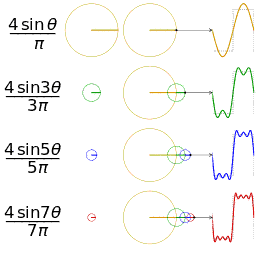
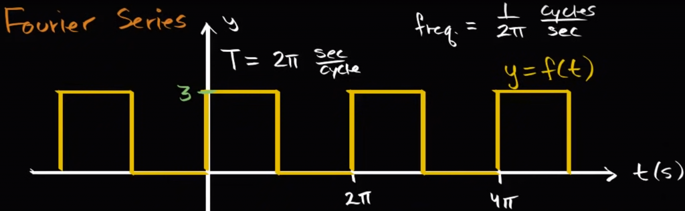

## 周期为 $2\pi$ 的傅里叶级数

傅里叶级数是一种利用三角函数近似周期函数的方法，本节将以周期为 $2\pi$ 的函数 $f(x)$ 为例，解析傅里叶级数是如何做到拟合的：
$$
f(x) = a_0 + \sum_{i=1}^{\infty} a_i\cos ix + \sum_{j=1}^{\infty}b_j\sin jx
$$

<figure>

<figcaption>一个分别采用傅里叶级数的前 1, 2, 3, 4 项近似方波的可视化</figcaption>
</figure>  

### 前置定理

:::note[定理1]
$$
\begin{aligned}
\int_{0}^{2\pi}\sin mx \mathrm dx &= 0,\ m为任意整数\\
\int_{0}^{2\pi}\cos mx\mathrm dx &=0,\ m为任意非零整数
\end{aligned}
$$
:::

证明很显然，以 $\int_{0}^{2\pi}\sin mx \mathrm dx = 0$ 为例：
$$
\begin{aligned}
\int_{0}^{2\pi}\sin mx \mathrm dx &=\frac{1}{m}\int_{0}^{2\pi}\sin mx \mathrm d(mx)\\
&=\frac{1}{m}\cdot -\cos mx\bigg|_{0}^{2\pi}\\
&=0
\end{aligned}
$$

:::note[定理2]
$$
\int_{0}^{2\pi}\sin mx\cos nx\mathrm dx = 0,\ m,n为任意整数
$$
:::

证明主要利用积化和差公式：

$$
\begin{aligned}
\int_{0}^{2\pi}\sin mx\cos nx\mathrm dx &= \int_{0}^{2\pi}\frac{1}{2}[\sin(mx+nx)+\sin(mx-nx)]\mathrm{d}x\\
&=\frac{1}{2}\int_{0}^{2\pi}\sin(m+n)x+\sin(m-n)x\\
&=0
\end{aligned}
$$

:::note[定理3]
$$
\int_{0}^{2\pi}\sin mx\sin nx \mathrm dx= \begin{cases}\pi & m=\pm n, m\neq 0\\0 & \text{otherwise}\end{cases}
$$
这里 $m,n$ 都是整数。
:::

首先证明 $m=n$ 的情况：

$$
\begin{aligned}
\int_{0}^{2\pi}\sin mx\sin nx \mathrm dx&= \int_{0}^{2\pi}\sin^2mx\mathrm dx\\
&=\int_0^{2\pi}-\frac{1}{2}[\cos 2mx - \cos 0x]\mathrm dx\\
&=\frac{1}{2}\int_0^{2\pi}1\mathrm dx\\
&=\pi
\end{aligned}
$$

然后 $m=-n$ 的情况是显然的，因此证明剩余部分：

$$
\begin{aligned}
\int_{0}^{2\pi}\sin mx\sin nx \mathrm dx&= \int_{0}^{2\pi}-\frac 1 2[\cos(m+n)x - \cos(m-n)x]\mathrm dx\\
&= 0
\end{aligned}
$$

同理，还存在对偶情况

$$
\int_{0}^{2\pi}\cos mx\cos nx \mathrm dx= \begin{cases}\pi & m=\pm n ,m\neq 0\\0 & \text{otherwise}\end{cases}
$$

证明略。

### 确定系数

有了以上的前置定理之后，我们就可以开始确定傅里叶级数的系数 $a_i,b_j$ 了。

#### 确定 $a_0$

确定系数的思路就是对等式 $f(x) = a_0 + \sum_{i=1}^{\infty} a_i\cos ix + \sum_{j=1}^{\infty}b_j\sin jx$ 两边积分，如下

$$
\begin{aligned}
f(x) &= a_0 + \sum_{i=1}^{\infty} a_i\cos ix + \sum_{j=1}^{\infty}b_j\sin jx\\
\int_0^{2\pi}f(x)\mathrm dx&=\int_0^{2\pi}\bigg[a_0 + \sum_{i=1}^{\infty} a_i\cos ix + \sum_{j=1}^{\infty}b_j\sin jx \bigg]\mathrm dx\\
\int_0^{2\pi}f(x)\mathrm dx&=2\pi a_0 + \sum_{i=1}^{\infty}a_i\int_0^{2\pi}\cos ix\mathrm dx + \sum_{j=1}^{\infty}\int_0^{2\pi}\sin jx\mathrm dx\\
\int_0^{2\pi}f(x)\mathrm dx&=2\pi a_0\\
a_0&=\frac{1}{2\pi}\int_0^{2\pi}f(x)\mathrm dx
\end{aligned}
$$

容易发现，$a_0$ 的几何意义就是 $f(x)$ 在一个周期上的平均值。

#### 确定 $a_i$

这里的做法也是等式两边积分，但是应用了一个技巧：两边同乘 $\cos cx$，这样就能消去除了 $a_c$ 以外的项的干扰。

$$
\begin{aligned}
f(x) &= a_0 + \sum_{i=1}^{\infty} a_i\cos ix + \sum_{j=1}^{\infty}b_j\sin jx\\
\int_0^{2\pi}f(x)\cos cx\mathrm dx&=\int_0^{2\pi}\bigg[a_0 + \sum_{i=1}^{\infty} a_i\cos ix + \sum_{j=1}^{\infty}b_j\sin jx \bigg]\cos cx\mathrm dx\quad(c是1,2,\cdots,n的常数)\\
\int_0^{2\pi}f(x)\cos cx\mathrm dx&= \int_{0}^{2\pi}a_c\cos cx\cos cx\mathrm dx\\
\int_0^{2\pi}f(x)\cos cx\mathrm dx&= \pi a_c\\
a_c&=\frac{1}{\pi}\int_0^{2\pi}f(x)\cos cx\mathrm dx
\end{aligned}
$$

#### 确定 $b_i$

和 $a_i$ 做法类似，直接给出结论：

$$
b_c=\frac{1}{\pi}\int_0^{2\pi}f(x)\sin cx\mathrm dx
$$

### 函数拟合的示例

以一个周期为 $2\pi$ 的方波为例，构造傅里叶级数。具体参数如下图所示（波峰为 $3$，波谷为 $0$）：

然后我们逐个确定傅里叶级数的系数：

- 首先确定 $a_0$，根据 $a_0$ 的几何意义（$f(x)$ 在一个周期上的平均值），直接就能计算出 $a_0=\frac{3}{2}$。

- 然后确定 $a_i(i\gt 0)$：
  $$
  \begin{aligned}
  a_i&=\frac {1}{\pi}\int_{0}^{2\pi}f(x)\cos ix\mathrm dx\\
  &=\frac{1}{\pi}\int_{0}^{\pi}3\cos ix\mathrm dx\\
  &=\frac{3}{i\pi}\sin ix\bigg|_0^{\pi}\\
  &=0\\
  \end{aligned}
  $$

- 最后确定 $b_i$：
  $$
  \begin{aligned}b_i&=\frac {1}{\pi}\int_{0}^{2\pi}f(x)\sin ix\mathrm dx\\&=\frac {1}{\pi}\int_{0}^{\pi}3\sin ix\mathrm dx\\&=\frac {-3}{i\pi}\cos ix\bigg|_0^{\pi}\\&=\frac {-3}{i\pi}(\cos i\pi - 1)\\&= \frac{3(1-\cos i\pi)}{i\pi}\end{aligned}
  $$

综上，我们就能写出这个方波的傅里叶级数了：
$$
b_i=
\begin{cases}
0 & \text{i is even}\\
\frac{6}{i\pi} & \text{i is odd}
\end{cases}
$$

### 收敛定理

1. 当 $t$ 是 $f(x)$ 的连续点时，级数收敛于 $f(t)$。
2. 当 $t$ 是 $f(x)$ 的第一类间断点时，级数收敛于 $\frac{f(t^+)+f(t^-)}{2}$。

*收敛定理主要的用处是说明第一类间断点在傅里叶级数中的数值。

:::tip[例题1]
设 $f(x)$ 是周期为 $2$ 的周期函数，它在区间 $(-1,1]$ 上定义为 $f(x)=\begin{cases} 2 & -1\lt x\le 0\\ x^3 & 0\lt x\le 1 \end{cases}$，则 $f(x)$ 的傅里叶级数在 $x=1$ 处收敛于（）。
:::

根据收敛定理，显然收敛于 $\frac{1}{2}[2+1]=\frac 3 2$。

### 正弦级数、余弦级数

傅里叶级数 $f(x) = a_0 + \sum_{i=1}^{\infty} a_i\cos ix + \sum_{j=1}^{\infty}b_j\sin jx$ 中虽然既有余弦也有正弦，但是在某些特殊情况下，傅里叶级数会只留下余弦或正弦（比如前文中的方波示例）。这里，实际上有一个比较实用的性质：奇函数的傅里叶级数是正弦级数（只含有正弦项），偶函数的傅里叶级数是余弦级数（只含有余弦项）。

上文中的方波例子是一个“广义”的奇函数。

证明实际上比较显然，我们以奇函数为例进行一个简要的说明，设 $f(x)$ 是一个周期为 $2\pi$ 的奇函数，那么

$$
\begin{aligned}
a_c&=\frac 1 \pi\int_{-\pi}^{+\pi}f(x)\cos cx\mathrm dx\\
b_c&=\frac 1 \pi\int_{-\pi}^{+\pi}f(x)\sin cx\mathrm dx
\end{aligned}
$$

因为 $f(x)$ 是奇函数，$\cos cx$ 是偶函数，所以 $f(x)\cos cx$ 是奇函数，即 $a_c=0$。

:::tip[例题2]
设 $f(x)$ 是周期为 $2\pi$ 的周期函数，它在 $[-\pi,\pi)$ 上的表达式为 $f(x)=|x|$，将 $f(x)$ 展开成傅里叶级数。
:::

$f(x)$ 显然是偶函数，因此其傅里叶级数只含有余弦项：

- 先求 $a_0$：
  $$a_0 = \frac{1}{2\pi}\int_{-\pi}^{+\pi}|x|\mathrm dx = \frac{\pi}{2}$$
- 再求 $a_n(n\gt 0)$：
  $$
  \begin{aligned}a_n &= \frac{2}{\pi}\int_0^{\pi}x\cos nx \mathrm dx\\&= \frac{2}{\pi} \frac{nx\sin (nx) + \cos(nx)}{n^2} \bigg|_0^\pi\\&= \frac{2(\cos n\pi - 1)}{\pi n^2}\\&= \begin{cases}-\frac{4}{\pi n^2} & n=1,3,5,\cdots\\0 & n=2,4,6,\cdots\end{cases}\end{aligned}
  $$

于是

$$
f(x) = \frac \pi 2 - \frac 4 \pi \sum_{k=1}^{\infty}\frac{\cos(2k-1)x}{(2k-1)^2}\quad(-\infty\lt x\lt +\infty)
$$

> 此时，如果我们令 $x=0$，则有
>
> $$
> f(0) = 0 = \frac{\pi}{2} - \frac{4}{\pi}\sum_{k=1}^{\infty}\frac{\cos 0}{(2k-1)^2}
> $$
>
> 可以求出无穷级数 $\sum_{k=1}^{+\infty}\frac{1}{(2k-1)^2}$ 的极限是 $\frac{\pi^2}{8}$。这是傅里叶级数在无穷级数中的一种应用。

## 一般周期的傅里叶级数

这一节我们研究更加一般的傅里叶级数，也就是对于任意周期函数构造傅里叶级数。

思路实际上很简单，我们直接放缩 $x$ 轴坐标即可。对于周期为 $2\pi$ 的函数，我们构造的三角函数是 $\cos nx, \sin nx$，这是因为这一系列三角函数都具有 $2\pi$ 的周期；那么对于周期为 $2l$ 的函数，我们只需要构造一系列具有周期为 $2l$ 的三角函数即可，也就是 $\cos \frac{n\pi x}{l}, \sin\frac{n\pi x}{l}$。即

$$
f(x) = a_0 + \sum_{i=1}^{\infty}a_i \cos \frac{i\pi x}{l} + \sum_{j=1}^{\infty} b_j\sin \frac{j\pi x}{l}
$$

### 确定系数

一般周期的傅里叶级数确定系数的方法本质上和 $2\pi$ 周期的一样，也就是多了一步 $x$ 轴的缩放。

- 确定 $a_0$：
  $$
  a_0 = \frac{1}{2l}\int_0^{2l}f(x)\mathrm dx
  $$
- 确定 $a_i(i\gt 0)$：
  $$
  a_i = \frac{1}{l}\int_0^{2l}f(x)\cos\frac{i\pi x}{l} \mathrm dx
  $$
- 确定 $b_j$：
  $$
  b_j = \frac{1}{l}\int_0^{2l}f(x)\sin\frac{j\pi x}{l} \mathrm dx
  $$

### 例题

:::tip[例题3]
设函数 $f(x)=x^2,0\le x\lt 1$，而 $S(x)=\sum_{n=1}^{\infty}b_n\sin n\pi x,-\infty\lt x\lt +\infty$。其中 $b_n=2\int_0^1f(x)\sin n\pi x\mathrm dx,n=1,2,3,\cdots$，则 $S(-\frac 1 2)=$（）。
:::

看到 $S(x)$ 这个无穷级数的形式就容易联想到傅里叶级数，并且更特殊的是，这是一个正弦级数，于是我们可以认为这个正弦级数的原函数是一个奇函数。

然后观察系数 $b_n$ 的形式，容易猜测：原函数就是 $f(x)$ 作奇延拓，即 $F(x)=\begin{cases}x^2 & 1\gt x\ge 0\\ -x^2 & 0\ge x\gt -1\end{cases}$。此时延拓得到的函数 $F(x)$ 的系数 $b_n$ 就是

$$
\begin{aligned}
b_n &=  \frac{1}{l}\int_{-l}^{+l}f(x)\sin\frac{n\pi x}{l} \mathrm dx\\
&= 2\int_0^1 f(x)\sin n\pi x \mathrm dx
\end{aligned}
$$

因此，根据收敛定理可得 $S(-\frac 1 2) = -\frac 1 4$。

:::tip[例题4]
将函数 $f(x)=2+|x|(-1\le x\le 1)$ 展开成以 $2$ 为周期的傅里叶级数，并由此求级数 $\sum_{n=1}^{\infty}\frac{1}{n^2}$ 的和。
:::

先求傅里叶级数，因为 $f(x)$ 是一个偶函数，所以这是一个余弦级数：

- 求 $a_0$：
  $$
  a_0 = \frac{1}{2l}\int_{-l}^{+l}f(x)\mathrm dx = \frac{5}{2}
  $$
- 求 $a_n(n\gt 0)$：
  $$
  \begin{aligned}
  a_n &= \frac{1}{l}\int_{-l}^{+l}f(x)\cos\frac{n\pi x}{l} \mathrm dx\\
  &= 2\int_0^1 (2+x)\cos n\pi x\mathrm dx\\
  &= \frac{2}{n^2\pi^2}[\cos(n\pi)-1]\\
  &= \begin{cases}
  0 & n=2k\\
  \frac{-4}{(2k-1)^2\pi^2} & n=2k-1
  \end{cases}
  \end{aligned}
  $$

于是

$$
f(x)=\frac 5 2 - \frac{4}{\pi^2}\sum_{k=1}^{\infty}\frac{\cos(2k-1)\pi x}{(2k-1)^2}
$$

令 $x=0$，则

$$
f(0)=2=\frac 5 2 - \frac{4}{\pi^2}\sum_{k=1}^{\infty}\frac{\cos(2k-1)\pi x}{(2k-1)^2}
$$

因此 $\sum_{k=1}^{\infty}\frac{1}{(2k-1)^2}=\frac{\pi^2}{8}$。
$$
\begin{aligned}
\sum_{k=1}^{\infty}\frac{1}{(2k)^2}+\sum_{k=1}^{\infty}\frac{1}{(2k-1)^2} &= \sum_{k=1}^{\infty}\frac{1}{k^2}\\
\frac 1 4 \sum_{k=1}^{\infty}\frac{1}{k^2}+\sum_{k=1}^{\infty}\frac{1}{(2k-1)^2} &= \sum_{k=1}^{\infty}\frac{1}{k^2}\\
\frac 3 4\sum_{k=1}^{\infty}\frac{1}{k^2} &= \frac{\pi^2}{8}\\
\sum_{k=1}^{\infty}\frac{1}{k^2} &= \frac{\pi^2}{6}
\end{aligned}
$$