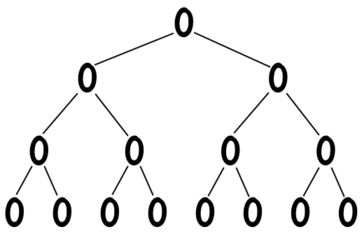
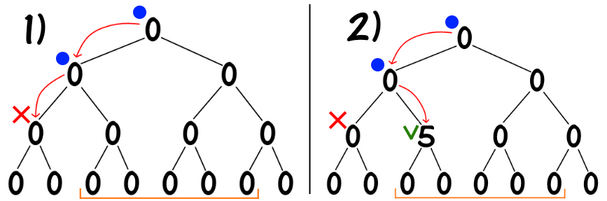
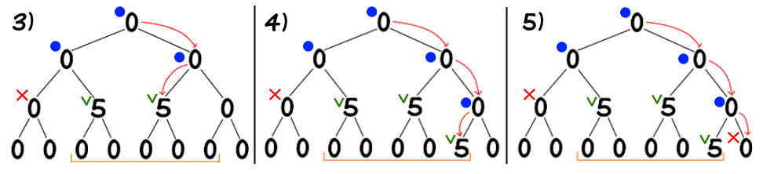
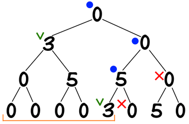
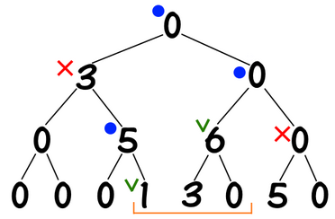
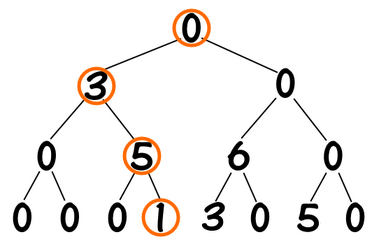
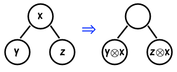

# 区间修改+单点查询

## 区间加+单点查询

> 给定一个 $n$ 个元素的数组 $a$，处理以下两种操作：
>
> 1. `add(l, r, x)`：对于 $a_i(l\le i\lt r)$ 加上 $x$。
> 2. `get(i)`：获取 $a_i$ 的值。

这是最经典和基本的线段树，线段树的核心思想就是：树上的每个节点负责处理原始数组的某一段区间，维护这段区间上发生的修改。如下图给出了一个 $8$ 个元素构成的线段树：



线段树的每个结点维护一段区间 $[l,r]$，每个结点（除了叶子）有两个子结点，左子节点维护 $[l,mid]$，右子节点维护 $[mid+1,r]$（$mid=(l+r)/2$）。当 $l=r$ 时，该节点就是一个叶子结点。

> 在代码中，我们一般认为线段树的根节点是 $1$；对于某个结点 $u$，它的左儿子是 $u*2$，右儿子是 $u*2+1$。

### 区间加

对于区间加 `add(l, r, x)`，我们的思路就是将 $[l,r)$ 这一段区间的变化拆解到一系列线段树上的小区间的变化。以 `add(3, 8, 5)` 为例：



如图所示，操作1中，我们尝试从覆盖了 $[1,4]$ 区间的结点走向其左子结点，但是左子结点覆盖的区间是 $[1,2]$，与我们需要修改的区间 $[3,7]$ 没有交集，因此返回。操作2中，我们尝试走向覆盖了 $[3,4]$ 的右子结点，而 $[3,4]$ 被 $[3,7]$ 包含，因此这是我们需要修改的区间，我们对该线段修改后返回（不需要继续向下更新了）。



右半子树同理，找到区间 $[5,6]$ 和 $[7,7]$ 后更新并返回。

让我们再处理 `add(1, 6, 3)` 和 `add(4, 7, 1)`：





总结，对于 $[ql,qr]$ 上的区间修改操作，线段树要做的就是在递归过程中找到覆盖了 $[l,r]$ 的结点（$ql\le l\le r\le qr$），修改这些结点并返回。（这里，我们用 $[ql,qr]$ 表示修改区间，$[l,r]$ 表示线段树某个结点覆盖的区间，后文将沿用这一记法）

> 复杂度分析：对于区间加操作，线段树的复杂度是什么？注意到，对于线段树上的每一层，我们至多找到两个符合 $ql\le l\le r\le qr$ 条件的线段，至多找到两个 $[ql,qr]$ 与 $[l,r]$ 没有交集的线段，因此一次递归的复杂度上限就是 $O(4\log n)$，因此区间加的复杂度为 $O(\log n)$。

### 单点查询

对于线段树的单点查询 `get(i)`，只需要一路递归找到覆盖了 $[i,i]$ 的结点，然后再回溯过程中将所有经过的区间上的数值相加即可。以 `get(4)` 为例，



我们找到的结点覆盖的区间分别是 $[1,4],[3,4],[4,4]$，因此最终得到 `get(4) = 9`。

### Code

[模板题 - 区间加+单点查询](https://codeforces.com/edu/course/2/lesson/5/1/practice/contest/279634/problem/A)。

```cpp
#include <bits/stdc++.h>
using namespace std;
using ll = long long;

class segTree {
public:
    int _n;
    struct node {
        ll add = 0;
    };
    vector<node> t;
    segTree(int n = 0) {
        _n = n;
        t.resize((_n + 1) * 4, { 0 });
    }
    void range_add(int rt, int l, int r, int ql, int qr, int v) {
        if (ql <= l && r <= qr) {
            t[rt].add += v;
            return;
        }
        int mid = (l + r) / 2;
        if (ql <= mid) range_add(rt * 2, l, mid, ql, qr, v);
        if (mid + 1 <= qr) range_add(rt * 2 + 1, mid + 1, r, ql, qr, v);
        return;
    }
    ll query(int rt, int l, int r, int pos) {
        if (l == r) {
            return t[rt].add;
        }
        int mid = (l + r) / 2;
        if (pos <= mid) return query(rt * 2, l, mid, pos) + t[rt].add;
        else return query(rt * 2 + 1, mid + 1, r, pos) + t[rt].add;
    }
};

int main() {
    ios::sync_with_stdio(false);
    cin.tie(nullptr);
    cout.tie(nullptr);
    int n, q;
    cin >> n >> q;
    segTree st(n);
    while (q--) {
        int type, x, y, z;
        cin >> type >> x;
        x++;
        if (type == 1) {
            cin >> y >> z;
            st.range_add(1, 1, n, x, y, z);
        } else {
            cout << st.query(1, 1, n, x) << "\n";
        }
    }
    return 0;
}
```

只需要实现 `range_add()` 和 `query()` 这两个函数。


## 同时满足结合律和交换律的运算

假设运算 $\otimes$ 表示任意一种运算（比如 $+,-,\times,\gcd$），如果同时满足以下性质：

1. 结合律：对于 $a,b,c\in G$，$a\otimes (b\otimes c) = (a\otimes b)\otimes c$。
2. 交换律：对于 $a,b\in G$，$a\otimes b = b\otimes a$。

则线段树可以直接维护。

假设 `modify(l, r, x)` 表示对于 $[l,r)$ 中的所有 $a_i$ 都进行 $a_i=a_i\otimes x$ 的运算，且 $\otimes$ 是任意一种同时满足结合律+交换律的运算。假设我们对某一区间进行了两次操作 `modify(l, r, x)` 和 `modify(l, r, y)`；显然，该区间中的元素应该变成了 $((a_i\otimes x)\otimes y)$，但是线段树维护的是区间上的修改，即 $(a_i\otimes (x\otimes y))$，因此该运算必须满足结合律。

那为什么要满足交换律？因为我们在进行区间修改时是自顶向下，而单点求值时是自底向上，因此必须有 $x\otimes y=y\otimes x$。

因此，我们可以用相同的方法解决[模板题 - 区间最值修改+单点查询](https://codeforces.com/edu/course/2/lesson/5/1/practice/contest/279634/problem/B)。

## 只满足结合律的运算

如果运算 $\otimes$ 只满足结合律，但并不满足交换律（比如矩阵乘法），我们可以通过懒惰标记（lazy propagation）的技术来处理。懒惰标记的核心思路是：保证所有的旧操作比新操作更深，并且在下推标记时用新操作去更新旧操作。

假设区间 $[l,r]$ 上已经存在了某种操作 $x$，该节点的两个儿子上已分别有旧操作 $y,z$，当我们需要从 $[l,r]$ 继续向下递归时，我们就需要下推懒惰标记，将两个子结点分别更新为 $y\otimes x,z\otimes x$。



如下图，蓝色结点表示当前递归中的根结点，橙色结点表示我们想要访问的结点，懒惰标记 $y$ 如图进行下推。


显然懒惰标记的一次下推复杂度是 $O(1)$，而线段树的一次区间修改操作和一次单点查询都是 $O(\log n)$，因此使用懒惰标记的线段树的复杂度不变。

## 区间覆盖+单点查询

> [模板题 - 区间覆盖+单点查询](https://codeforces.com/edu/course/2/lesson/5/1/practice/contest/279634/problem/C)
>
> 给定一个 $n$ 个元素的数组 $a$，处理以下两种操作：
>
> 1. `assign(l, r, v)`：对于 $a_i(l\le i\lt r)$ 赋值为 $v$。
> 2. `get(i)`：查询 $a_i$ 的值。

区间覆盖是一个典型的只满足结合律，但不满足交换律的运算，因此需要懒惰标记。

```cpp
#include <bits/stdc++.h>
using namespace std;
using ll = long long;

class segTree {
public:
    int _n;
    struct node {
        int lazy_cover;
    };
    vector<node> t;
    segTree(int n = 0) {
        _n = n;
        t.resize((_n + 1) * 4, { -1 });
    }
    void pushdown(int rt) {
        if (t[rt].lazy_cover != -1) {
            int lc = rt * 2, rc = rt * 2 + 1;
            t[lc].lazy_cover = t[rt].lazy_cover;
            t[rc].lazy_cover = t[rt].lazy_cover;
            t[rt].lazy_cover = -1;
        }
    }
    void range_cover(int rt, int l, int r, int ql, int qr, int v) {
        if (ql <= l && r <= qr) {
            t[rt].lazy_cover = v;
            return;
        }
        pushdown(rt);
        int mid = (l + r) / 2;
        if (ql <= mid) range_cover(rt * 2, l, mid, ql, qr, v);
        if (mid + 1 <= qr) range_cover(rt * 2 + 1, mid + 1, r, ql, qr, v);
        return;
    }
    int query(int rt, int l, int r, int pos) {
        if (l == r) {
            return t[rt].lazy_cover;
        }
        pushdown(rt);
        int mid = (l + r) / 2;
        if (pos <= mid) return query(rt * 2, l, mid, pos);
        else return query(rt * 2 + 1, mid + 1, r, pos);
    }
};

int main() {
    ios::sync_with_stdio(false);
    cin.tie(nullptr);
    cout.tie(nullptr);
    int n, q;
    cin >> n >> q;
    segTree st(n);
    while (q--) {
        int type, x, y, z;
        cin >> type >> x;
        x++;
        if (type == 1) {
            cin >> y >> z;
            st.range_cover(1, 1, n, x, y, z);
        } else {
            cout << max(0, st.query(1, 1, n, x)) << "\n";
        }
    }
    return 0;
}
```

与基础线段树的唯一不同之处在于，我们需要实现一个叫做 `pushdown()` 的函数，该函数用于处理懒惰标记的下推。当且仅当我们需要从当前结点向下继续搜索时，我们需要在进入子结点之前先将当前节点的懒惰标记传递到两个子结点。


# 区间修改+区间查询

## 区间加+区间最值

> [模板题 - 区间加+区间最值](https://codeforces.com/edu/course/2/lesson/5/2/practice/contest/279653/problem/A)
>
> 给定一个 $n$ 个元素的数组 $a$，处理以下两种操作：
>
> 1. `add(l, r, v)`：对于 $a_i(l\le i\lt r)$ 加上 $x$。
> 2. `min(l, r)`：求区间 $[l,r]$ 中最小的 $a_i$。

举个例子，对于数组 `[3, 4, 2, 5, 6, 8, 1, 3]` 构造一棵维护区间最小值的线段树：


现在，我们对于每个结点维护两个值：区间加的懒惰标记 `lazy_add` 和区间最小值 `min_elem`，然后以一次更新 `add(3, 8, 2)` 为例：


同样是递归将大区间划分到线段树上的一系列小区间，然后注意到：假设某一段区间 $[l,r]$ 整体加上了 $v$，那么这一段区间的最小值也会加上 $v$，表现在图中就是值分别为 $4, 8, 3$ 的结点（最小值）都加上了 $2$，并且这三个结点被打上了懒惰标记 `lazy_add = 2`。


对于懒惰标记的下推也是同理，当需要从某个结点向下走时，先将父节点的信息下推至子结点，以图中橙色结点为例。

但是，只更新 $4,8,3$ 这三个结点是不够的，对于一个线段 $[l,r]$，该线段上的最小值是左儿子 $[l,mid]$ 上最小值和右儿子 $[mid+1,r]$ 上最小值中的最小值，即 `min(l, r) = min(min(l, mid + 1), min(mid + 1, r))`。也就是说，在回溯过程中，我们需要对于我们访问路径上的所有父结点进行更新，以确保线段树上所有被访问过的结点存储了正确的信息，只有未被访问的结点才可能未被最新的信息更新（这也就是lazy propagation命名的来源）。

代码如下

```cpp
#include <bits/stdc++.h>
using namespace std;
using ll = long long;
const ll INF = 1e18;

class segTree {
public:
    int _n;
    struct node {
        ll lazy_add, min_elem;
    };
    vector<node> t;
    segTree(int n = 0) {
        _n = n;
        t.resize((_n + 1) * 4, { 0,0 });
    }
    void pushdown(int rt) {
        if (t[rt].lazy_add != 0) {
            int lc = rt * 2, rc = rt * 2 + 1;
            t[lc].lazy_add += t[rt].lazy_add;
            t[rc].lazy_add += t[rt].lazy_add;
            t[lc].min_elem += t[rt].lazy_add;
            t[rc].min_elem += t[rt].lazy_add;
            t[rt].lazy_add = 0;
        }
    }
    void pushup(int rt) {
        int lc = rt * 2, rc = rt * 2 + 1;
        t[rt].min_elem = min(t[lc].min_elem, t[rc].min_elem);
    }
    void range_add(int rt, int l, int r, int ql, int qr, int v) {
        if (ql <= l && r <= qr) {
            t[rt].lazy_add += v;
            t[rt].min_elem += v;
            return;
        }
        pushdown(rt);
        int mid = (l + r) / 2;
        if (ql <= mid) range_add(rt * 2, l, mid, ql, qr, v);
        if (mid + 1 <= qr) range_add(rt * 2 + 1, mid + 1, r, ql, qr, v);
        pushup(rt, l, r);
        return;
    }
    ll range_min(int rt, int l, int r, int ql, int qr) {
        if (ql <= l && r <= qr) {
            return t[rt].min_elem;
        }
        pushdown(rt);
        int mid = (l + r) / 2;
        ll res = INF;
        if (ql <= mid) res = min(res, range_min(rt * 2, l, mid, ql, qr));
        if (mid + 1 <= qr) res = min(res, range_min(rt * 2 + 1, mid + 1, r, ql, qr));
        pushup(rt);
        return res;
    }
};

int main() {
    ios::sync_with_stdio(false);
    cin.tie(nullptr);
    cout.tie(nullptr);
    int n, q;
    cin >> n >> q;
    segTree st(n);
    while (q--) {
        int type, x, y, z;
        cin >> type >> x >> y;
        x++;
        if (type == 1) {
            cin >> z;
            st.range_add(1, 1, n, x, y, z);
        } else {
            cout << st.range_min(1, 1, n, x, y) << "\n";
        }
    }
    return 0;
}
```

相较于区间修改+单点查询，这份代码多了一个函数 `pushup()`，该函数的作用是在回溯过程中，父节点通过子结点的最新信息进行更新。

## 其他运算

假设有以下两种操作：

1. `modify(l, r, x)`：表示将 $a_i(l\le i\lt r)$ 更新为 $a_i=a_i\otimes x$。
2. `calc(l, r)`：表示计算 $a_i\odot a_{i+1}\odot\cdots\odot a_{r-1}$。

这里 $\otimes$ 和 $\odot$ 满足以下性质：

1. $\otimes$ 和 $\odot$ 都满足结合律。这是一个**必要条件**，不过不难理解，因为线段树最核心的性质就是维护满足结合律的运算（根据前文，我们需要计算 $((a_i\otimes x)\otimes y)$，实际上线段树维护了 $(a_i\otimes (x \otimes y))$）。
2. $\otimes$ 相对于 $\odot$ 可分配。这是一个**必要条件**，可以类比分配律 $(a\otimes x)\odot (b\otimes x) = (a\odot b)\otimes x$。例如对于区间加+区间最小值就满足 $\min(a + x, b + x) = \min(a, b) + x$。

根据以上分析，可以解决以下练习题：

- [区间乘+区间和](https://codeforces.com/edu/course/2/lesson/5/2/practice/contest/279653/problem/B)

- [区间或+区间与](https://codeforces.com/edu/course/2/lesson/5/2/practice/contest/279653/problem/C)

- [区间加+区间和](https://codeforces.com/edu/course/2/lesson/5/2/practice/contest/279653/problem/D)

  区间加+区间求和相对特殊，因为 $(a+x)+(b+x)=(a+b)+2x$，注意到这似乎不满足传统意义上的分配律（本质上，全是加法就不存在分配律），但是实际上我们也只需要处理一下系数即可（对于区间加的标记乘上区间长度）。

- [区间覆盖+区间最值](https://codeforces.com/edu/course/2/lesson/5/2/practice/contest/279653/problem/E)

- [区间覆盖+区间和](https://codeforces.com/edu/course/2/lesson/5/2/practice/contest/279653/problem/F)

## 幺半群与线段树模板

### 幺半群

先看幺半群的定义：一个 **幺半群（Monoid）** 是一个集合 $M$ 和一个二元运算 $\circ$，满足以下条件：

1. **封闭性**：对于任意 $a,b\in M$，有 $a\circ b\in M$
2. **结合性**：对于任意 $a,b,c\in M$，有 $(a \circ b) \circ c = a \circ (b \circ c)$
3. **单位元**：存在一个元素 $e\in M$，使得对于任意 $a\in M$，有 $e \circ a = a \circ e =a$

而线段树这一数据结构可以维护所有的幺半群。举一些例子，实际上之前的大部分运算都可以用幺半群解释（下面给出的运算都有显然的封闭性，结合性）：

- $+,-$ 运算：对于加减法，单位元是 $0$。
- $\times$ 运算：乘法的单位元是 $1$。
- 矩阵乘法运算：矩阵乘法的单位元是单位矩阵（主对角线为1，其余为0的矩阵）。
- $\min,\max$ 运算：对于 $\min,\max$ 运算，$\min$ 运算的单位元是 $+\infty$，$\max$ 运算的单位元是 $-\infty$。


### 模板化（区间仿射变换+区间和）

通过幺半群的思想，我们可以模板化线段树这一数据结构。例如ac-library中的[Lazy Segtree](https://github.com/atcoder/ac-library/blob/master/document_en/lazysegtree.md)，这个模板的线段树采用的是非递归线段树（ZKW线段树），具有更好的常数，但是我还是以递归式线段树为基准。虽然我们不直接采用ac-library的代码，但是可以沿用ac-library的接口定义。

如下定义一棵线段树：

```cpp
template<class S, auto op, auto e, class F, auto mapping, auto composition, auto id>
class segTree {
public:
    // ...
private:
    int _n;
    vector<S> data;
    vector<F> lazy;
};
```

这里 $S$ 是一个幺半群，$(S,\cdot):S\times S\to S,e\in S$；$F$ 是一个 $S\to S$ 映射的集合，并且满足

1. $F$ 含有恒等映射 $\text{id}$，即 $\text{id}(x)=x$ 对于任意 $x\in S$ 成立。
2. $F$ 在复合映射下封闭，即 $f\circ g\in F$ 对于任意 $f,g\in F$ 成立。
3. $f(x\cdot y)=f(x)\cdot f(y)$ 成立（$\cdot$ 是定义幺半群的二元运算）。

引入一个模板题以解释：

> [区间仿射变换+区间和](https://judge.yosupo.jp/problem/range_affine_range_sum)
>
> 维护两种操作：
>
> 1. `0 l r b c`：对于区间 $[l,r)$ 中的元素 $a_i$，赋值为 $a_i\leftarrow b\times a_i+c$（区间仿射变换）。
> 2. `1 l r`：查询 $[l,r)$ 的区间和。

然后我们逐个解释模板类的定义：

1. `class S`：这是幺半群中元素的定义，以“区间仿射变换+区间和”为例，这里的元素就是每一个结点对应的（区间和，区间长度）这个二元组。
2. `auto op`：或者更准确地，`S (*op)(S, S)`；这是定义幺半群的二元运算，以“区间仿射变换+区间和”为例，这个二元运算就是区间加（区间和相加，区间长度相加），更准确的说是 `push_up` 时两段区间合并的运算。
3. `auto e`：单位元；以“区间仿射变换+区间和”为例，单位元就是 $0$，因为二元运算是加法。
4. `class F`：映射集合中任意元素的定义，或者说这就是区间修改的定义；以“区间仿射变换+区间和”为例，区间仿射变换就是将区间中的所有元素 $x$ 变成 $cx+d$，因此每个映射可以抽象为一个二元组 $<c,d>$。
5. `auto mapping`：或者更准确地，`S (*mapping)(F, S)`，这是映射的定义；比如仿射变换是 $f(x)=cx+d$，那么 `mapping` 就是将 $x$ 映射要 $cx+d$ 的函数。
6. `auto composition`：或者更准确地，`F (*composition)(F, F)`，这是复合映射的定义；在线段树懒惰标记下推（`push_down`）时，我们就会遇到：父节点上新的映射 $f$ 需要与子结点上旧的映射 $g$ 进行复合这一操作，而 `composition` 函数就是处理这一过程的。
7. `auto id`：恒等映射；以“区间仿射变换+区间和”为例，恒等映射就是 $f(x)=1x+0$，即 $c=1,d=0$。

综上，我们就能写出“区间仿射变换+区间和”这一问题中的所有定义了

```cpp
struct S {
    int sum, size;  // 区间和, 区间长度
};
S op(S l, S r) {
    return { add(l.sum, r.sum), l.size + r.size };
}
S e() {
    return { 0,1 };
}

struct F {
    int c, d;  // f(x) = cx + d.
    bool operator == (const F& k) const { return c == k.c and d == k.d; }
};
S mapping(F f, S x) {  // 注意我们维护的是区间和, 因此f(x) = c * sum + d * size
    return { add(mul(f.c, x.sum), mul(f.d, x.size)),x.size };
}
F composition(F f, F g) {  // f(g(x))
    return { mul(f.c,g.c),add(mul(f.c, g.d), f.d) };
}
F id() {
    return { 1,0 };
}
```

然后给出维护幺半群的线段树模板（递归版）：

```cpp
template<class S, auto op, auto e, class F, auto mapping, auto composition, auto id>
class segTree {
public:
    segTree() : segTree(0) {}
    explicit segTree(int n) : segTree(std::vector<S>(n, e())) {}
    explicit segTree(const vector<S>& v) : _n(int(v.size())) {
        data.resize(4 * _n, e());
        lazy.resize(4 * _n, id());

        auto build = [&](auto&& self, int rt, int l, int r) -> void {
            if (l == r) {
                data[rt] = v[l - 1];
                return;
            }
            int mid = (l + r) / 2;
            self(self, rt * 2, l, mid);
            self(self, rt * 2 + 1, mid + 1, r);
            push_up(rt);
        };
        build(build, 1, 1, _n);
    }
    void push_up(int rt) {
        data[rt] = op(data[2 * rt], data[2 * rt + 1]);
    }
    void apply(int rt, F f) {
        data[rt] = mapping(f, data[rt]);
        lazy[rt] = composition(f, lazy[rt]);
    }
    void push_down(int rt) {
        if (lazy[rt] == id()) {
            return;
        }
        apply(2 * rt, lazy[rt]);
        apply(2 * rt + 1, lazy[rt]);
        lazy[rt] = id();
    }
    void range_modify(int rt, int l, int r, int ql, int qr, F f) {
        if (r < ql or l > qr) {
            return;
        }
        if (ql <= l and r <= qr) {
            apply(rt, f);
            return;
        }
        push_down(rt);
        int mid = (l + r) / 2;
        range_modify(rt * 2, l, mid, ql, qr, f);
        range_modify(rt * 2 + 1, mid + 1, r, ql, qr, f);
        push_up(rt);
    }
    S range_query(int rt, int l, int r, int ql, int qr) {
        if (r < ql or l > qr) {
            return e();
        }
        if (ql <= l and r <= qr) {
            return data[rt];
        }
        push_down(rt);
        int mid = (l + r) / 2;
        auto&& res = op(range_query(rt * 2, l, mid, ql, qr), range_query(rt * 2 + 1, mid + 1, r, ql, qr));
        push_up(rt);
        return res;
    }
private:
    int _n;
    vector<S> data;
    vector<F> lazy;
};
```

[AC Link](https://atcoder.jp/contests/practice2/submissions/61229095).

总结就是：对于一棵常规的带有懒惰标记的线段树，我们将所有需要实现的部分抽象到了7个部分。

此外，我们还能把线段树上二分也集成进去，这也可以参考ac-library的定义。但我感觉这个模板化并不好用，大部分情况都要改模板内的代码，代码实现请参考下一节中的线段树上二分。


# 经典问题

## 线段树维护最大子段和

> [区间覆盖+最大子段和](https://codeforces.com/edu/course/2/lesson/5/3/practice/contest/280799/problem/A)
>
> 维护以下两种操作：
>
> 1. `assign(l, r, v)`：对于 $a_i(l\le i\lt r)$ 赋值为 $v$。
> 2. `max_seg(l, r)`：询问区间 $[l,r)$ 上的最大子段和。

对于每一个结点（假设当前结点覆盖了 $[l,r]$），维护以下几种信息：

1. `seg`：$[l,r]$ 上的最大子段和
2. `pre`：$[l,r]$ 上的最大前缀子段和
3. `suf`：$[l,r]$ 上的最大后缀子段和
4. `sum`：$[l,r]$ 上的元素之和

在pushup过程中这样合并左右儿子信息：

```cpp
// rt是父节点; lc, rc 分别是左右儿子
t[rt].sum = t[lc].sum + t[rc].sum;
t[rt].pre = max(t[lc].pre, t[lc].sum + t[rc].pre);
t[rt].suf = max(t[rc].suf, t[rc].sum + t[lc].suf);
t[rt].seg = max({ t[lc].seg,t[rc].seg,t[lc].suf + t[rc].pre });
```

因为父节点的最大子段和只能是 左儿子的最大子段和 或 右儿子的最大子段和 或 跨越两段区间的最大子段和，如果跨越了左右儿子的区间，那么就一定是左儿子的最大后缀+右儿子的最大前缀。

## 0-1线段树找第K个1

> [区间翻转+K-th one](https://codeforces.com/edu/course/2/lesson/5/3/practice/contest/280799/problem/B)
>
> 对于一个只含有 $0,1$ 两种元素的数组，维护以下两种操作：
>
> 1. 翻转 $[l,r)$ 中的所有元素（$0$ 变 $1$，$1$ 变 $0$）
> 2. 求第 $k$ 个 $1$ 的下标

对于操作2，实际上我们只需要维护一个线段和。假设当前在根节点，左儿子的区间和为 $sum_l$，如果 $k\gt sum_l$，那么显然我们应该走向右儿子，查找第 $k-sum_l$ 个 $1$ 的下标；否则走向左儿子。

对于操作1，我们维护一个区间翻转的懒惰标记即可，区间被翻转时，新的区间和就是区间总长度减去老的区间和。

## 线段树查找第一个不小于 $x$ 的元素（线段树上二分）

> [区间加+lower_bound](https://codeforces.com/edu/course/2/lesson/5/3/practice/contest/280799/problem/C)
>
> 维护以下两种操作：
>
> 1. `add(l, r, v)`：对于 $a_i(l\le i\lt r)$ 加上 $x$。
> 2. `lower_bound(l, x)`：查询第一个满足 $j\ge l,a[j]\ge x$ 的元素的下标。

实际上很简单，我们维护一下线段的区间最大值即可，如果左儿子的区间最大值超过 $x$ 并且左儿子的区间和 $[l,+\infty)$ 有交集就向左儿子递归，如果左儿子没找到或者符合条件的元素就向右儿子递归。复杂度分析很简单：和区间加的复杂度分析类似，线段树上每一层最多两次失败查询+两次成功查询，因此复杂度是 $O(\log n)$。

> 线段树上的lower_bound操作甚至不需要序列单调。这是因为我们本质上是在线段树维护的前缀最值数组中进行二分，而这个数组是单调的。

```cpp
// 找第一个满足 a[j] >= x and j >= lo 的下标j
// 如果不存在就返回 n + 1
int min_left(int rt, int l, int r, int lo, ll x) {
    if (l == r) {
        return l;
    }
    push_down(rt);
    int mid = (l + r) / 2, res = _n + 1;
    if (mid >= lo and data[rt * 2].max_elem >= x) res = min_left(rt * 2, l, mid, lo, x);
    if (res > _n and data[rt * 2 + 1].max_elem >= x) res = min_left(rt * 2 + 1, mid + 1, r, lo, x);
    push_up(rt);
    return res;
}
```


## 动态开点

> [715. Range 模块](https://leetcode.cn/problems/range-module/)
>
> 对于长度为 $n(n=1e9)$ 的0-1数组，维护以下几种操作：
>
> 1. `1 l r v`：将区间 $[l,r)$ 内的每个数赋值为 $v$，$v=0$ 或 $1$。
> 2. `2 l r`：查询区间 $[l,r)$ 内的元素是否全是 $1$。

如果 $n$ 很小，那么本题用线段树维护非常简单；但是由于 $n=1e9$，所以不能直接上线段树。

如果离线+离散化可行的话，本题还是很简单；可惜本题强制在线，因此就需要一种叫做“动态开点”的技巧。

观察线段树的结构，我们不难发现，只有我们需要访问的结点才需要被创建（比如我要遍历到结点 $[l,r]$ 后返回，它的两个子结点实际上并不需要被创建），因此动态开点的思想就是当我们需要走到某一个结点时才声明这个节点。

在代码实现中，我们可以在 `push_down` 时进行子结点的创建（这样就能保证我们一定创建了所有可能走到的结点）。动态开点所需内存更大，注意多开空间。

```cpp
template<class S, auto op, auto e, class F, auto mapping, auto composition, auto id>
class dynamicSegTree {
public:
    dynamicSegTree() : dynamicSegTree(0) {}
    // 注意这里尽量多开空间 不知道会申请多少结点
    explicit dynamicSegTree(int n, int m = (int)2e6 * 4 + 10) : _n(n) {
        data.reserve(m);
        lazy.reserve(m);
        t.reserve(m);
        t.push_back({ -1,-1,-1,-1 });
        lazy.push_back(id());
        data.push_back(e());
        nodes = 0;
        make_node(1, n);  // root
    }
    int make_node(int l, int r) {
        t.push_back({ l,r,-1,-1 });
        lazy.push_back(id());
        data.push_back(e());
        return ++nodes;
    }
    void push_up(int rt) {
        auto&& [l, r, lc, rc] = t[rt];
        data[rt] = op(data[lc], data[rc]);
    }
    void apply(int rt, F f) {
        data[rt] = mapping(f, data[rt]);
        lazy[rt] = composition(f, lazy[rt]);
    }
    void push_down(int rt) {
        auto&& [l, r, lc, rc] = t[rt];
        int mid = (l + r) / 2;
        if (lc == -1) {
            lc = make_node(l, mid);
        }
        if (rc == -1) {
            rc = make_node(mid + 1, r);
        }
        if (not (lazy[rt] == id())) {
            apply(lc, lazy[rt]);
            apply(rc, lazy[rt]);
        }
        lazy[rt] = id();
    }
    void range_modify(int rt, int ql, int qr, F f) {
        auto&& [l, r, lc, rc] = t[rt];
        if (r < ql or l > qr) {
            return;
        }
        if (ql <= l and r <= qr) {
            apply(rt, f);
            return;
        }
        push_down(rt);
        int mid = (l + r) / 2;
        range_modify(lc, ql, qr, f);
        range_modify(rc, ql, qr, f);
        push_up(rt);
    }
    S range_query(int rt, int ql, int qr) {
        auto&& [l, r, lc, rc] = t[rt];
        if (r < ql or l > qr) {
            return e();
        }
        if (ql <= l and r <= qr) {
            return data[rt];
        }
        push_down(rt);
        int mid = (l + r) / 2;
        auto&& res = op(range_query(lc, ql, qr), range_query(rc, ql, qr));
        push_up(rt);
        return res;
    }
private:
    int _n, nodes;
    vector<tuple<int, int, int, int>> t;  // (l, r, lc, rc)
    vector<S> data;
    vector<F> lazy;
};
```


# 练习题

## [Assignment, Addition, and Sum](https://codeforces.com/edu/course/2/lesson/5/4/practice/contest/280801/problem/A)

> 维护三种操作：
>
> 1. 区间覆盖
> 2. 区间加
> 3. 区间求和

其实就是搞清楚区间加和区间覆盖的懒惰标记在下推时的顺序。

```cpp
struct S {
    ll sum, size;
};
S op(S l, S r) {
    return { l.sum + r.sum,l.size + r.size };
}
S e() {
    return { 0,1 };
}
 
struct F {
    ll add, cover;
    bool operator == (const F& k) const { return add == k.add && cover == k.cover; }
};
S mapping(F f, S x) {
    if (f.cover == -1) {  // 只有区间加时 f(x) += add * size
        return { x.sum + 1LL * x.size * f.add, x.size };
    } else {              // 既有区间覆盖又(可能)有区间加 f(x) = cover * size + add * size
        return { 1LL * x.size * (f.add + f.cover), x.size };
    }
}
F composition(F f, F g) {  // f(g(x))
    auto h = f;            // 如果新操作存在区间覆盖 那么旧操作直接作废
    if (f.cover == -1) {   // 新操作不存在区间覆盖 那就只更新区间加
        h.cover = g.cover;
        h.add = g.add + f.add;
    }
    return h;
}
F id() {
    return { 0,-1 };
}
```

## [Add Arithmetic Progression On Segment](https://codeforces.com/edu/course/2/lesson/5/4/practice/contest/280801/problem/B)

> 维护两种操作：
>
> 1. 区间加等差数列
> 2. 单点求值

因为只要求单点求值，所以我们维护差分数组 $d_i=a_i-a_{i-1}$ 就行了，在差分数组上区间加等差数列就是普通的区间加公差+末尾单点修改。单点求值就是差分数组前缀和。

## [Painter](https://codeforces.com/edu/course/2/lesson/5/4/practice/contest/280801/problem/C)

> 对于一个0-1数组维护以下两种操作：
>
> 1. 区间覆盖
> 2. 查询区间 $[L,R)$ 的区间和以及连续的1有几段。

对于每个结点维护：

1. `sum`：区间和
2. `lb`：左端点是否为1
3. `rb`：右端点是否为1
4. `cnt`：区间中连续的1有几段

pushup时 `t[rt].cnt = t[lc].cnt + t[rc].cnt - (t[lc].rb == 1 && t[rc].lb == 1)`（当两端区间的交界处都为1时去重）。

## [Problem About Weighted Sum](https://codeforces.com/edu/course/2/lesson/5/4/practice/contest/280801/problem/D)

> 维护两种操作：
>
> 1. 区间加
> 2. 区间阶梯查询，给定区间 $[l,r]$，查询 $a[l] \cdot 1 + a[l + 1] \cdot 2 + \dots \ a[r] \cdot (r - l + 1)$

维护两个数组：`a[1], a[2], a[3], ..., a[n]` 和 `a[1], 2*a[2], 3*a[3], ..., n*a[n]`。

## [IOI2014 - Wall](https://codeforces.com/edu/course/2/lesson/5/4/practice/contest/280801/problem/E)

> 维护两种操作：
>
> 1. `chmax l r x`：将区间 $[l,r)$ 中的元素 $a_i$ 替换为 $\max(a_i,x)$。
> 2. `chmin l r x`：将区间 $[l,r)$ 中的元素 $a_i$ 替换为 $\min(a_i,x)$。
>
> 完成所有操作后，询问最终的数组。

其实不难发现，由于这道题并没有区间查询操作，所以 `push_up` 是不需要的，因此幺半群 $S$ 也没有维护的必要，我们只需要维护区间修改集合 $F$ 即可。

```cpp
const int INF = 1e9 + 5;
struct S {
    int val, size;
};
S op(S l, S r) {
    return { l.val + r.val,l.size + r.size };
}
S e() {
    return { 0,1 };
}

struct F {
    int chmin, chmax;
    bool operator == (const F& k) const { return chmin == k.chmin && chmax == k.chmax; }
};
S mapping(F f, S x) {
    if (x.size != 1) {  // 不是叶子结点就不用更新了
        return x;
    }
    x.val = max(x.val, f.chmax);
    x.val = min(x.val, f.chmin);
    return x;
}
F composition(F f, F g) {  // f(g(x))
    auto h = f;
    h.chmax = max(h.chmax, g.chmax);
    h.chmin = min(h.chmin, g.chmin);
    if (h.chmin < h.chmax) {  // 当两种操作产生矛盾时需要判断取左端点or右端点
        if (f.chmin < g.chmax) h.chmax = h.chmin;
        else h.chmin = h.chmax;
    }
    return h;
}
F id() {
    return { INF,-1 };
}
```

## [IOI2005 - Mountain](https://vjudge.net/problem/DMOJ-ioi05p2)

> 对于一个差分数组 $d_i=a_i-a_{i-1}$ ，维护：
>
> 1. `I a b D`：将区间 $[l,r]$ 中的 $d_i$ 修改为 $D$。
> 2. `Q h`：询问第一个大于 $h$ 的 $a_i$。

实际上就是需要维护前缀和最值，令前缀和最值为 `max_pre`，则 `rt.max_pre = max(lc.max_pre, lc.sum + rc.max_pre)`，在 `push_up` 时更新即可。

此外本题需要动态开点。