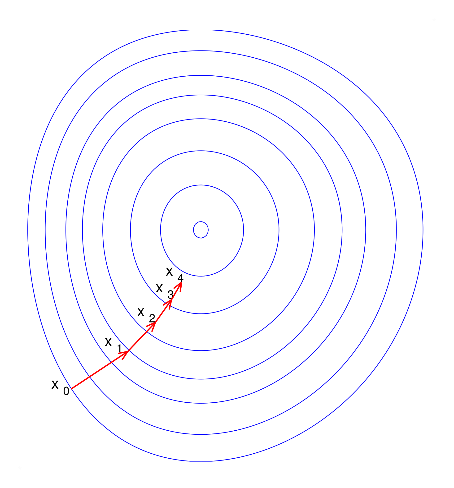

# Softmax Regression

这是[**Deep Learning Systems** Lecture 2 - ML Refresher / Softmax Regression](https://www.youtube.com/watch?v=MlivXhZFbNA)的学习笔记。

## Three Ingredients of ML algorithm

1. **The hypothesis class**

   也就是将输入映射到输出的程序流程。

2. **Loss function**

   用于衡量hypothesis class表现如何。

3. **An optimization method**

   减小loss、优化参数的方法。

## The Softmax Regression Optimization Problem

### Notation

- 假设问题的输入是一个长为 $n$ 的一维向量，所求输出是一个长为 $k$ 的一维向量，输入数据一共有 $m$ 个。

  > 比如，MNIST训练集有60000幅图像，每幅图像都是 $28\times 28$ 的灰度图，需要分为10种数字类别。对应本节描述就是 $n=28\times 28=784,k=10,m=60000$。

- hypothesis class $h:\mathbb R^n \to \mathbb R^k$，也就是将输入映射到输出的函数。特别地，在本文中将采用线性算子作为hypothesis class，也就是
  $$
  h_{\theta}(x) = \theta^T x
  $$
  这里 $\theta\in\mathbb R^{n\times k}$。（也就是一个简单的线性加权，因为 $x\in \mathbb R^{n\times 1}$）

- Matrix batch notation

  在实际情况下，我们往往会将数据打包为矩阵，而不是单独处理一维向量，因此有以下matrix batch notation：
  $$
  X\in\mathbb{R}^{m\times n} = \begin{pmatrix}
  x^{(1)^{T}}\\
  \vdots\\
  x^{(m)^{T}}\\
  \end{pmatrix}
  $$

  $$
  y\in\{1,\ldots,k\}^m = \begin{pmatrix}
  y^{(1)}\\
  \vdots\\
  y^{(m)}
  \end{pmatrix}
  $$

  这里 $X$ 表示将输入打包后的矩阵，$y$ 表示对应的标签（not one-hot）。将线性假设应用到batch中，就有
  $$
  h_{\theta}(X) = \begin{pmatrix}
  h_{\theta}(x^{(1)^T})\\
  \vdots\\
  h_{\theta}(x^{(m)^T})\\
  \end{pmatrix}
  $$

### Softmax / Cross-Entropy Loss

softmax的作用往往是将hypothesis class的输出转为概率，
$$
z_i = P(label=i) = \frac{\exp(h_i(x))}{\sum_{j=1}^k\exp(h_j(x))}\Leftrightarrow z = \text{normalize}(\exp(h(x)))
$$
这里 $z\in\mathbb{R}^{k}$，表示将输出 $h(x)$ 通过softmax转换为概率分布。

Cross-Entropy Loss是最常见的loss function，表示为
$$
\begin{aligned}
\ell_{ce}(h(x),y) &= -\log P(label=y)\\
&= -\log \frac{\exp(h_y(x))}{\sum_{j=1}^k\exp(h_j(x))}\\
&= -\log \exp(h_y(x)) + \log \sum_{j=1}^k \exp(h_j(x))\\
&= -h_y(x) + \log \sum_{j=1}^k \exp(h_j(x))
\end{aligned}
$$

### The Softmax Regression Optimization Problem

我们可以将机器学习的三个组成成分简化为一个优化问题：
$$
\min_{\theta} \frac {1}{m}\sum_{i=1}^m \ell(h_\theta(x^{(i)}),y^{(i)})
$$
即最小化hypothesis class的平均loss。

在本文中则是
$$
\min_{\theta} \frac {1}{m}\sum_{i=1}^m \ell_{ce}(\theta^Tx^{(i)},y^{(i)})
$$

## Gradient Descent

### Gradient Descent(TODO)



### Stochastic Gradient Descent

相较于直接的梯度下降，机器/深度学习中往往采用Stochastic Gradient Descent，即随机梯度下降。这里，Stochastic体现在计算梯度时，并不是使用整个训练集来计算，而是随机选取训练集中的一个小批量样本来估算梯度，从而进行参数更新。

具体地，传统的梯度下降方法（Batch Gradient Descent）会在每次迭代中使用整个训练集来计算梯度并更新模型参数，这会导致计算成本非常高，尤其是在训练集很大的时候。而在SGD中，每次参数更新是基于单个样本或者小批量样本的梯度。

这种随机选择的方式带来了两个主要特点：

1. **计算速度更快**：由于每次迭代只计算一个小批量或单个样本的梯度，计算时间比全量梯度下降要短。
2. **噪声性**：由于每次梯度计算只基于部分样本，所以梯度更新会带有噪声，表现为更不稳定的更新路径。这种噪声在短期内可能导致不收敛或震荡，但长远来看，可以帮助跳出局部最优解，从而找到更好的全局最优解。

具体可以表示为：

Repeat:

- Sample a minibatch of data $X\in \mathbb R^{B\times n}, y\in\{1,\ldots,k\}^B$
- Update parameters $\theta:= \theta - \frac{\alpha}{B}\sum_{i=1}^B\nabla_\theta\ell(h_{\theta}(x^{(i)}),y^{(i)})$

### The Gradient of the  Softmax Objective

#### $\nabla_{\theta}\ell_{ce}(\theta^T x,y)$

> 目标：计算 $\nabla_{\theta}\ell_{ce}(\theta^T x,y)$。

首先我们计算softmax的偏导数，也就是 $\frac{\partial \ell_{ce}(h,y)}{\partial h_i}$，
$$
\begin{aligned}
\frac{\partial \ell_{ce}(h,y)}{\partial h_i} &= \frac{\partial }{\partial  h_i}(-h_y+\log \sum_{j=1}^k \exp(h_j))\\
&= -[i=y] + \frac{\frac{\partial }{\partial  h_i}\sum_{j=1}^k \exp(h_j)}{\sum_{j=1}^k \exp(h_j)}\\
&= -[i=y] + \frac{\exp(h_i)}{\sum_{j=1}^k \exp(h_j)}
\end{aligned}
$$
不难发现该式的后半部分就是softmax，所以 $\nabla_h \ell_{ce}(h,y)$ 可以表示为
$$
\nabla_h \ell_{ce}(h,y) = z - e_y
$$
$z = \text{normalize}(\exp(h))$，$e_y$ 则是标签 $y$ 的one-hot编码。

然后我们再计算 $\nabla_{\theta}\ell_{ce}(\theta^T x,y)$，注意这里对矩阵的求导我们假设“一切都是标量”（也就是假设 $\theta$ 就是一个标量而非向量），然后直接对 $\theta$ 应用链式法则，并且按经验重排矩阵的维度，而不是正常的严谨数学推导（多元微积分）。
$$
\begin{aligned}
\frac{\partial}{\partial \theta} \ell_{ce}(\theta^T x,y) &= \frac{\partial \ell_{ce}(\theta^T x,y)}{\partial \theta^T x} \cdot \frac{\partial \theta^T x}{\partial \theta}\\
&= (z-e_y)\cdot x
\end{aligned}
$$
注意这个链式法则的左半部就是上方推导的softmax的偏导数，而后半部分就是对线性加权的偏导。

但是这有个问题，$z-e_y$ 和 $x$ 的维度不能直接点乘，根据维度 $z-e_y\in\mathbb R^{k\times 1}, x\in\mathbb R^{n\times 1}$，然后，不难分析出 $\frac{\partial}{\partial \theta} \ell_{ce}(\theta^T x,y)$ 的维度应该和 $\theta$ 是一样的（$\theta$ 需要直接减去这个gradient），所以我们应该将维度改写成 $x\cdot(z-e_y)^T$，即
$$
\begin{aligned}
\frac{\partial}{\partial \theta} \ell_{ce}(\theta^T x,y) &= x\cdot(z-e_y)^T
\end{aligned}
$$

> 实际上就是完全按照经验调整维度。

#### matrix batch

实际上，我们一般是对输入打包进行处理，也就是所谓的matrix batch，这种暴力偏导仍然可以成立。

> 目标：计算 $\nabla_{\theta}\ell_{ce}(X\theta,y)$。

注意因为 $X\in \mathbb R^{m\times n}$，所以 $\theta$ 这回为了统一维度变成了矩阵右乘，显然 $\theta\in\mathbb R^{n\times k}$。
$$
\begin{aligned}
\frac{\partial}{\partial \theta} \ell_{ce}(X\theta,y) &= \frac{\partial \ell_{ce}(X\theta,y)}{\partial X\theta} \cdot \frac{\partial X\theta}{\partial \theta}\\
&= (Z-I_y)\cdot X
\end{aligned}
$$
这里 $Z-I_y\in\mathbb R^{m\times k}$，可以认为是 $m$ 个向量的堆叠；$X\in \mathbb R^{m\times n}$，因此我们要将这个结果按照维度重排为 $X^T\cdot(Z-I_y)$。
$$
\frac{\partial}{\partial \theta} \ell_{ce}(X\theta,y) = X^T\cdot(Z-I_y)
$$

## MNIST

### Python

这是一个linear hypothesis对于MNIST数据集的分类算法的个人实现，测试集 `acc = 0.92`。

```python
import loguru
import numpy as np
import gzip
from tqdm import tqdm
from copy import copy


def read_idx(filename):
    with gzip.open(filename, 'rb') as f:
        # 读取文件头（前16个字节）
        data = f.read()
        # 解析文件头信息
        magic_number = int.from_bytes(data[0:4], byteorder='big')
        if magic_number == 2051:
            # 图像文件，读取图像数据
            num_images = int.from_bytes(data[4:8], byteorder='big')
            num_rows = int.from_bytes(data[8:12], byteorder='big')
            num_cols = int.from_bytes(data[12:16], byteorder='big')
            # 图像数据
            images = np.frombuffer(data[16:], dtype=np.uint8).reshape(num_images, num_rows, num_cols)
            return images
        elif magic_number == 2049:
            # 标签文件，读取标签数据
            num_labels = int.from_bytes(data[4:8], byteorder='big')
            labels = np.frombuffer(data[8:], dtype=np.uint8)
            return labels
        else:
            raise ValueError("Unknown magic number")


image_file_tr = 'train-images-idx3-ubyte.gz'
image_file_ts = 't10k-images-idx3-ubyte.gz'
label_file_tr = 'train-labels-idx1-ubyte.gz'
label_file_ts = 't10k-labels-idx1-ubyte.gz'


class linear_model:
    def __init__(self, n=784, k=10, lr=1e-3, batch_size=100):
        self.n = n
        self.k = k
        self.lr = lr
        self.eps = 1e-7
        self.batch_size = batch_size
        self.theta = np.random.randn(self.n, self.k).astype(np.float32)

    def compute_loss(self, x, y):
        # 1. 计算 softmax
        # 为了避免溢出，减去每行的最大值（数值稳定性）
        exp_x = np.exp(x - np.max(x, axis=1, keepdims=True))
        exp_x += self.eps
        softmax_probs = exp_x / np.sum(exp_x, axis=1, keepdims=True)

        # 2. 获取每个样本的正确类别的预测概率
        correct_probs = softmax_probs[np.arange(len(y)), y]

        # 3. 计算交叉熵损失
        loss = -np.mean(np.log(correct_probs))

        return loss

    def compute_gradient(self, x1, x2, y):
        exp_x = np.exp(x2 - np.max(x2, axis=1, keepdims=True))
        exp_x += self.eps
        z = exp_x / np.sum(exp_x, axis=1, keepdims=True)

        e_y = np.zeros((y.shape[0], self.k), dtype=np.float32)
        e_y[np.arange(y.size), y] = 1

        xt = x1.T.astype(np.float32)

        g = np.matmul(xt, z - e_y)
        return g

    def forward(self, x, y, mode='train'):
        input_x = copy(x)
        x = x @ self.theta
        if mode == 'train':
            loss = self.compute_loss(x, y)
            gradient = self.compute_gradient(input_x, x, y)
            self.theta = self.theta - self.lr * gradient / self.batch_size
            return x, loss
        else:
            return x


if __name__ == '__main__':
    train_images = read_idx(image_file_tr)
    train_labels = read_idx(label_file_tr)
    test_images = read_idx(image_file_ts)
    test_labels = read_idx(label_file_ts)

    train_images = np.reshape(train_images, (train_images.shape[0], 28 * 28)).astype(np.float32)
    test_images = np.reshape(test_images, (test_images.shape[0], 28 * 28)).astype(np.float32)
    train_images = train_images / 255.0
    test_images = test_images / 255.0
    m = 10
    epochs = 100
    model = linear_model(n=784, k=10, lr=0.1, batch_size=m)
    for e in range(epochs):
        loguru.logger.info(f"Epoch {e+1}/{epochs}")
        with tqdm(total=len(train_images) // m, desc=f"loss = {0}") as pbar:
            loss_sum = np.zeros(1)
            for i in range(len(train_images) // m):
                x = train_images[i * m: (i + 1) * m]
                y = train_labels[i * m: (i + 1) * m]
                _, loss = model.forward(x, y)
                loss_sum += loss
                pbar.set_description(f"loss = {loss}")
                pbar.update()
            pbar.close()
            loguru.logger.info(f"epoch {e+1}, average loss = {loss_sum / (len(train_images) // m)}")
            preds = model.forward(test_images, test_labels, 'test')
            preds = np.argmax(preds, axis=1)
            acc = np.sum(preds == test_labels) / len(test_labels)
            loguru.logger.info(f"accuracy = {acc}")
            if (e + 1) % 2 == 0:
                model.lr *= 0.9
```

### Cpp

cpp实现移植于[dlsys hw0](https://github.com/st1vdy/dlsys-hw/blob/main/hw0-main/src/simple_ml_ext.cpp)。

```cpp
#include <bits/stdc++.h>

using std::vector;

template<typename ...T>
auto print(T&&... args) {
    ((std::cout << args << " "), ...) << "\n";
}

template<typename T> struct matrix {
    size_t n, m;
    vector<vector<T>> a;

    matrix(size_t n_, size_t m_, int val = 0) : n(n_), m(m_), a(n_, vector<T>(m_, val)) {}

    matrix(const T* x, size_t n_, size_t m_) {
        n = n_, m = m_;
        a.resize(n, vector<T>(m));        
        for (int i = 0; i < n; i++) {
            for (int j = 0; j < m; j++) {
                a[i][j] = *(x + i * m + j);
            }
        }
    }

    vector<T>& operator[](int k) { return this->a[k]; }

    matrix operator - (matrix& k) { return matrix(*this) -= k; }

    matrix operator * (matrix& k) { return matrix(*this) *= k; }

    matrix& operator -=(matrix& mat) {
        assert(n == mat.n);
        assert(m == mat.m);
        for (int i = 0; i < n; i++) {
            for (int j = 0; j < m; j++) {
                a[i][j] -= mat[i][j];
            }
        }
        return *this;
    }

    matrix& operator *= (matrix& mat) {
        assert(m == mat.n);
        int x = n, y = mat.m, z = m;
        matrix<T> c(x, y);
        for (int i = 0; i < x; i++) {
            for (int k = 0; k < z; k++) {
                T r = a[i][k];
                for (int j = 0; j < y; j++) {
                    c[i][j] += mat[k][j] * r;
                }
            }
        }
        return *this = c;
    }

    matrix<T> transpose() {
        matrix<T> result(m, n);
        for (int i = 0; i < m; i++) {
            for (int j = 0; j < n; j++) {
                result[i][j] = a[j][i];
            }
        }
        return result;
    }

    matrix<float> softmax() {
        matrix<float> result(*this);
        for (int i = 0; i < n; i++) {
            auto& v = result.a[i];
            auto mx = *std::max_element(v.begin(), v.end());
            for (auto& j : v) {
                j -= mx;
                j = std::exp(j);
            }
            auto exp_sum = std::accumulate(v.begin(), v.end(), (float)0.0);
            for (auto& j : v) {
                j /= exp_sum;
            }
        }
        return result;
    }
};

float ce_loss(matrix<float>& Z, matrix<uint8_t>& I_y) {
    int batch = Z.n;
    float sum = 0;
    for (int i = 0; i < batch; i++) {
        float v = Z[i][I_y[i][0]];
        v = -std::log(v);
        sum += v;
    }
    return sum / static_cast<float>(batch);
}

float softmax_regression_epoch_cpp(const float* X, const unsigned char* y,
    float* theta, size_t m, size_t n, size_t k,
    float lr, size_t batch)
{
    /**
     * A C++ version of the softmax regression epoch code.  This should run a
     * single epoch over the data defined by X and y (and sizes m,n,k), and
     * modify theta in place.  Your function will probably want to allocate
     * (and then delete) some helper arrays to store the logits and gradients.
     *
     * Args:
     *     X (const float *): pointer to X data, of size m*n, stored in row
     *          major (C) format
     *     y (const unsigned char *): pointer to y data, of size m
     *     theta (float *): pointer to theta data, of size n*k, stored in row
     *          major (C) format
     *     m (size_t): number of examples
     *     n (size_t): input dimension
     *     k (size_t): number of classes
     *     lr (float): learning rate / SGD step size
     *     batch (int): SGD minibatch size
     *
     * Returns:
     *     (None)
     */

     /// BEGIN YOUR CODE
    float alpha = lr / static_cast<float>(batch);
    float loss = 0;
    for (int e = 0; e < m / batch; e++) {
        matrix<float> batch_X(X + e * batch * n, batch, n);
        matrix<unsigned char> batch_y(y + e * batch, batch, 1);
        matrix<float> t(theta, n, k);

        auto&& XW = batch_X * t;
        auto&& XT = batch_X.transpose();
        auto&& Z = XW.softmax();
        matrix<float> I_y(batch, k);
        auto loss_i = ce_loss(Z, batch_y);
        loss += loss_i;

        // X^T @ (Z - I_y)
        for (int i = 0; i < batch; i++) {
            I_y[i][batch_y[i][0]] = 1;
        }
        Z -= I_y;
        auto&& res = XT * Z;

        for (int i = 0; i < n; i++) {
            for (int j = 0; j < k; j++) {
                *(theta + i * k + j) -= res[i][j] * alpha;
            }
        }
    }

    return loss / (m / batch);
    /// END YOUR CODE
}

float predict(const float* X, const unsigned char* y, const float* theta, size_t m, size_t n, size_t k) {
    matrix<float> MX(X, m, n);
    matrix<float> W(theta, n, k);
    auto&& res = MX * W;
    int num_acc = 0;
    for (int i = 0; i < m; i++) {
        auto&& v = res.a[i];
        int pred_class = max_element(v.begin(), v.end()) - v.begin();
        int tp = *(y + i);
        num_acc += (pred_class == tp);
    }
    return static_cast<float>(num_acc) / m;
}

uint32_t swap_endian(uint32_t val) {
    return ((val >> 24) & 0x000000FF) |  // 获取最高字节
        ((val >> 8) & 0x0000FF00) |   // 获取次高字节
        ((val << 8) & 0x00FF0000) |   // 获取次低字节
        ((val << 24) & 0xFF000000);   // 获取最低字节
}

void read_mnist_images(const std::string& filepath, std::vector<std::vector<uint8_t>>& images, int& num_images, int& rows, int& cols) {
    std::ifstream file(filepath, std::ios::binary);

    uint32_t magic_number, num_items;
    uint32_t num_rows, num_cols;

    file.read(reinterpret_cast<char*>(&magic_number), 4);
    magic_number = swap_endian(magic_number);  // 转换字节序（小端 -> 大端）

    file.read(reinterpret_cast<char*>(&num_items), 4);
    num_items = swap_endian(num_items);

    file.read(reinterpret_cast<char*>(&num_rows), 4);
    num_rows = swap_endian(num_rows);

    file.read(reinterpret_cast<char*>(&num_cols), 4);
    num_cols = swap_endian(num_cols);

    num_images = num_items;
    rows = num_rows;
    cols = num_cols;
    images.resize(num_images, std::vector<uint8_t>(rows * cols));

    for (int i = 0; i < num_images; ++i) {
        file.read(reinterpret_cast<char*>(images[i].data()), rows * cols);
    }
}

void read_mnist_labels(const std::string& filepath, std::vector<uint8_t>& labels, int& num_labels) {
    std::ifstream file(filepath, std::ios::binary);

    // 读取头部信息
    uint32_t magic_number, num_items;
    file.read(reinterpret_cast<char*>(&magic_number), 4);
    magic_number = swap_endian(magic_number);  // 转换字节序（小端 -> 大端）

    file.read(reinterpret_cast<char*>(&num_items), 4);
    num_items = swap_endian(num_items);

    num_labels = num_items;
    labels.resize(num_labels);

    // 读取所有标签数据
    file.read(reinterpret_cast<char*>(labels.data()), num_labels);
}

float* convert_vec(const std::vector<std::vector<uint8_t>>& images_tr) {
    size_t num_images = images_tr.size();
    if (num_images == 0)
        return nullptr;

    size_t image_size = images_tr[0].size();
    float* flattened = new float[num_images * image_size];

    for (size_t i = 0; i < num_images; i++) {
        const std::vector<uint8_t>& img = images_tr[i];
        for (size_t j = 0; j < image_size; j++) {
            flattened[i * image_size + j] = static_cast<float>(img[j]) / 255.0;
        }
    }

    return flattened;
}

uint8_t* convert_vec(const std::vector<uint8_t>& images_tr) {
    size_t num_images = images_tr.size();
    if (num_images == 0)
        return nullptr;

    uint8_t* flattened = new uint8_t[num_images];

    for (size_t i = 0; i < num_images; i++) {
        flattened[i] = images_tr[i];
    }

    return flattened;
}

std::mt19937 rng(114);
float generateRandomNumber() {
    std::normal_distribution<float> distribution(0.0f, 1.0f);
    return distribution(rng);
}

void solve(std::vector<std::vector<uint8_t>>& images_tr, std::vector<std::vector<uint8_t>>& images_ts,
    std::vector<uint8_t>& labels_tr, std::vector<uint8_t> labels_ts) {
    int num_samples = images_tr.size();
    int batch_size = 50;
    int epochs = 10;
    float* train_images = convert_vec(images_tr);
    float* test_images = convert_vec(images_ts);
    uint8_t* train_labels = convert_vec(labels_tr);
    uint8_t* test_labels = convert_vec(labels_ts);
    
    int m = 60000;
    int n = 784;
    int k = 10;
    float lr = 0.2;
    float* theta = new float[n * k];
    for (int i = 0; i < n * k; i++) {
        theta[i] = generateRandomNumber();
    }
    int tm = 10000;
    for (int e = 0; e < epochs; e++) {
        auto loss = softmax_regression_epoch_cpp(train_images, train_labels, theta, m, n, k, lr, batch_size);
        auto acc = predict(test_images, test_labels, theta, tm, n, k);
        print("Epoch", e + 1, "| loss =", loss, "| acc =", acc);
    }
}

int main() {
    // 注意这里要解压文件
    std::string images_path_tr = "train-images-idx3-ubyte";
    std::string images_path_ts = "t10k-images-idx3-ubyte";
    std::string labels_path_tr = "train-labels-idx1-ubyte";
    std::string labels_path_ts = "t10k-labels-idx1-ubyte";
    int num_images_tr, num_labels_tr, rows, cols;
    int num_images_ts, num_labels_ts;
    std::vector<std::vector<uint8_t>> images_tr, images_ts;
    std::vector<uint8_t> labels_tr, labels_ts;

    read_mnist_images(images_path_tr, images_tr, num_images_tr, rows, cols);
    read_mnist_images(images_path_ts, images_ts, num_images_ts, rows, cols);
    read_mnist_labels(labels_path_tr, labels_tr, num_labels_tr);
    read_mnist_labels(labels_path_ts, labels_ts, num_labels_ts);

    solve(images_tr, images_ts, labels_tr, labels_ts);
}
```

